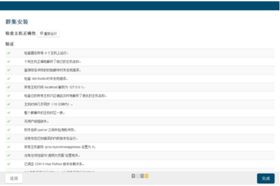

#Centos7+CDH5.7.2集群搭建


##一、前期准备

#####1、虚拟机配置（本例为3节点）

 主节点：8g内存、硬盘120g
 
 从节点：2g内存、硬盘120g
 
#####2、软件资源

	1.JDK
	2.Scala
	3.MySQL相关包
	4.CDH安装相关包
	5.系统CentOS 7版本

相关资源链接如下

* [jdk1.8](https://pan.baidu.com/s/1bFsbQEPovggWWGivnqw_EQ)
提取码：vwbt 

* [Scala2.12](https://pan.baidu.com/s/1rsn3WIMPK2LkdmTC2tWMAA)
提取码：ys5c 

* [mysql相关包](https://pan.baidu.com/s/1czvIRHi7oH1QYui1-5VNVQ)
提取码：9v0e 

* [CDH安装相关包](https://pan.baidu.com/s/151l8w2Jl8AwhKdIuNTjgyg)
提取码：gpi1 

#####3、集群的规划

| IP地址        | 主机名 | 说明        |
|:-------:|:------------- | :----------|
| 192.168.75.41| cdh01 | 主节点、从节点|
|192.168.75.42|cdh02|从节点|
|192.168.75.43|cdh03|从节点|

---


##二、开始安装前配置和预装软件


###1、服务器配置

每台节点服务器的有关配置，包括网络，IP、hostname、selinux，防火墙，DNS等。

**在虚拟机安装centos7时选择compute node配置即可**

####1.1 设置本地虚拟机网络的连接模式及网关

用于集群节点之前的通信及外网访问


####1.2 节点的IP配置

* 配置网络IP地址文件

```
cd /etc/sysconfig/network-scripts/
```	


* 本机的网络IP文件为ifcfg-ens33,打开配置文件配置，请注意GATEWAY为上面虚拟机设置的网关。

```
vi /etc/sysconfig/network-scripts/ifcfg-ens33
```


* 重启网络服务

```
#重启网卡
service network restart
#查看IP地址
ifconfig
```


* 三个服务器节点改下IP地址，其他相同配置。

####1.3 hostname修改

下以节点cdh01为例，其他如下配置改下hostname
此处修改完成需要重启才能生效

```
vi /etc/sysconfig/network
 
#配置内容
NETWORKING=yes
HOSTNAME=cdh01
```

####1.4．关闭防火墙

```
#查看防火墙状态
firewall-cmd --state
#停止防火墙的服务 
systemctl stop firewalld 
#禁止开机启动
systemctl disable firewalld 
```

####1.5 selinux关闭

```
vi /etc/sysconfig/selinux

SELINUX=disabled

```
重启才能生效，重启后检查。

```
sestatus -v

SELinux status: disabled #表示已经关闭了。
```

####1.6 免密登录配置
安装过程中master需要各个节点的root免登录密码，先在master上生成公钥：(在每个节点顺序执行以下命令)

	ssh-keygen
	ssh-copy-id root@192.168.75.41
	ssh-copy-id root@192.168.75.42
	ssh-copy-id root@192.168.75.43

####1.7 ip和主机名映射关系

	vi /etc/hosts
	#内容如下
	127.0.0.1   localhost
	::1         localhost
	192.168.75.41 cdh01
	192.168.75.42 cdh02
	192.168.75.43 cdh03
内容如上，保存退出，然后可以使用scp命令将这个配置拷贝给其他主机。

	scp /etc/hosts root@192.168.75.42:/etc/hosts

####1.8 NTP服务器设置(可选，节点较少，节点时间偏差不大（5分钟内）可不配置)
节点时间同步配置

	所有节点都需安装
	yum -y install ntp
	
	1.在主节点cdh01执行
	vi /etc/ntp.conf
	2.注释掉所有server *.*.*的指向，新添加一条可连接的ntp服务器
	server ntp.sjtu.edu.cn iburst
	3.在两个从节点执行
	vi /etc/ntp.conf
	注释掉所有server *.*.*的指向，新添下面一条把ntp指向master服务器地址(/etc/ntp.conf下)
	server cdh01 iburst
	4.所有节点启动服务
	service ntpd start
	5.查看ntp服务状态
	ntpq –p


	如上图，可以看到offset和jitter都有对应的值，remote中带星号（*）的为ntp挡圈选中的授时服务点，LOCAL表示本机，所以可以看到当前选择的授时服务点即为本机。
	
###2、第三方依赖包

####2.1 其他依赖

所有节点执行

```

yum install chkconfig python bind-utils psmisc libxslt zlib sqlite fuse fuse-libs redhat-lsb cyrus-sasl-plain cyrus-sasl-gssapi

```

####2.2 MySQL connector jar包

这个环节只需要在主节点上进行即可。

    1.在cdh01上准备mysql的jar包：
    mkdir -p /usr/share/java
    2.修改jar包的名字，并拷贝到/usr/share/java/目录：
	cp mysql-connector-java-5.1.38-bin.jar /usr/share/java/mysql-connector-java.jar

####2.3 安装jdk

这个是所有服务的基础，每个节点都需要安装。

	1．卸载jdk
	安装之前首先检查一下，你的服务器是否默认安装了OpenJDK，如果系统自带了，就需要卸载，步骤如下：

	#检查是否安装
	[root@cdh01~]java -version
	java version "1.7.0_75"
	OpenJDK Runtime Environment 	(rhel-2.5.4.2.el7_0-x86_64 u75-b13)
	OpenJDK 64-Bit Server VM (build 24.75-b04, mixed mode)
	#查看需要卸载的包
	[root@cdh01~]rpm -qa | grep jdk
	java-1.7.0-openjdk-1.7.0.75-2.5.4.2.el7_0.x86_64
	java-1.7.0-openjdk-headless-1.7.0.75-2.5.4.2.el7_0.x86_64
	#卸载
	[root@cdh01~]yum -y remove java-1.7.0-openjdk-1.7.0.75-2.5.4.2.el7_0.x86_64
	[root@cdh01~]yum -y remove java-1.7.0-openjdk-headless-1.7.0.75-2.5.4.2.el7_0.x86_64
	#再次检查
	[root@cdh01~]java -version
	bash: /usr/bin/java: No such file or directory
    如果没有安装，则可以跳过此步骤。
    2．安装jdk
    mkdir -p /usr/share/jdk/
    
    tar -zxvf jdk-8u191-linux-x64.tar.gz -C /usr/share/jdk/
    
    vi /etc/profile
    
    
	#在文件中追加
	export JAVA_HOME=/usr/share/jdk/jdk1.8.0_191/
	export PATH=$PATH:$JAVA_HOME/bin
	
	#保存退出之后，这里还需要设置一个软连接：
	mkdir /usr/java
	ln -s /home/software/jdk1.8 /usr/java/default
	注：CDH平台安装的时候默认寻找的jdk路径为/usr/java。

####2.4 安装Scala

这个是spark服务的基础，每个节点都需要安装。

	mkdir -p /usr/scala/
	tar -zxvf scala-2.11.0.tgz -C /usr/scala/
	
	vi /etc/profile
	
	#在文件中追加
	export SCALA_HOME=/usr/scala/scala-2.12.8
	export PATH=$PATH:$SCALA_HOME/bin

####2.5 安装mysql
	
MySQL的安装只需要在主节点进行即可。
	
	1.卸载mariadb
	[root@cdh01]rpm -qa | grep mariadb
	mariadb-libs-5.5.41-2.el7_0.x86_64
	2.如存在上述情形，按照下面卸载
	[root@cdh01]rpm -e --nodeps mariadb-libs-5.5.41-2.el7_0.x86_64
	3.安装mysql
		3.1创建用户及用户组
			#增加用户组mysql：
			groupadd mysql
			#增加用户mysql，加入mysql用户组：
			useradd -r -g mysql mysql
		3.2安装MySQL
			#安装server：
			rpm -ivh MySQL-server-5.6.29-1.linux_glibc2.5.x86_64.rpm
			#安装client：
			rpm -ivh MySQL-client-5.6.29-1.linux_glibc2.5.x86_64.rpm
		3.3添加随机启动
			cp /usr/share/mysql/mysql.server /etc/init.d/mysqld
		3.4启动MySQL
			service mysqld start
		3.5修改密码
			cat /root/.mysql_secret #此密码只能用来修改密码使用。
			mysqladmin -u root -p  password root
		3.6连接测试
			#连接进入mysql，命令如下：
			mysql -u root -p
			root
			#查看mysql的安装运行路径，命令如下：
			ps -ef|grep mysql
####2.6 MySQL相关问题
* Q .mysql\_secret文件不存在或者.mysql\_secret中的密码无法登陆？

  A:使用无需验证的方式，配置方法如下
 
 ```
 	#打开文件，
	vi /usr/my.cnf 
	#如果此路径下无该文件请用命令
	find / -name my.cnf

    
    #追加配置项，停止权限验证
    skip-grant-tables=1 
    
    #重启mysql服务
     service mysqld restart
     
 ```
* Q 执行下面这句？

		GRANT ALL PRIVILEGES ON *.* TO IDENTIFIED BY '123' WITH GRANT OPTION;
	
	报错：
	
		mysql> GRANT ALL PRIVILEGES ON *.* TO IDENTIFIED BY '123' WITH GRANT OPTION;
	
		ERROR 1290 (HY000): The MySQL server is running with the --skip-grant-tables option so it cannot execute this statement


	A: 先执行一下，在执行赋权命令
	
		flush privileges;
		
* Q: Your password has expired. To log in you must change it using a client that supports expired passwords.

	A: 
			
		root权限登录mysql：mysql -uroot -p

		登录成功后修改密码：set password=password('root');

		(将root的密码修改为root)。

* Q.连接被拒绝，而且赋予所有权限还是连接被拒绝

		com.cloudera.enterprise.dbutil.DbProvisioner.executeSql(DbProvisioner.java) - Exception when creating/dropping database with user ‘root‘ and jdbc url ‘jdbc:mysql://10.100.200.40/?useUnicode=true&characterEncoding=UTF-8‘
		java.sql.SQLException: Access denied for user ‘root‘@‘cdh01‘ (using password: YES)
		
* A：将原来的mysql登陆密码重新修改一下并赋权

		use mysql;
		#更新数据库的数据登录的密码。
		update user set Password = password(‘root‘) where User=‘root‘; 
		#给数据库赋予远程连接的权限。
		GRANT ALL PRIVILEGES ON *.* TO root@"%" IDENTIFIED BY "root"; 
		#在这里我们可以查看root用户的主句名称，用户和密码
		select Host,User,Password from user where User=‘root‘; 

		flush privileges;


#### 3 创建数据库（CDH用）
	create database hive DEFAULT CHARSET utf8 COLLATE utf8_general_ci;
	create database amon DEFAULT CHARSET utf8 COLLATE utf8_general_ci;
	create database hue DEFAULT CHARSET utf8 COLLATE utf8_general_ci;
	create database monitor DEFAULT CHARSET utf8 COLLATE utf8_general_ci;
	create database oozie DEFAULT CHARSET utf8 COLLATE utf8_general_ci;


#### 4.前置预置环境检查

为了给后续安装减少重装风险，在这里进行预置环境检查。如果后续安装有误，可退回到这一步重新安装。

* 1.确认三个节点IP地址为规划地址
三个节点上分别执行

		ifconfig

* 2.确认三个节点hostname
三个节点上分别执行

		hostname

* 3.确认hosts文件配置
三个节点上分别执行

		cat /etc/hosts

* 4 确认防火墙和selinux关闭
三个节点上分别执行


		firewall-cmd --state
		sestatus -v


* 5.确认网络互通和免密登陆
三个节点上分别执行

		ping cdh02
		ssh cdh02


	


* 6.确认节点间时间差不超过5分钟
三个节点上分别执行
	
		date


* 7.确认jdk和scala环境
三个节点上分别执行

		java -version
		scala -version


### 三 安装Cloudera-Manager

将Cloudera相关的四个包，如下：

    cloudera-manager-centos7-cm5.7.2_x86_64.tar.gz

    CDH-5.7.2-1.cdh5.7.2.p0.11-el7.parcel

    CDH-5.7.2-1.cdh5.7.2.p0.11-el7.parcel.sha1

    manifest.json
    

上传到所有的服务器上，在所有的服务器上执行以下操作。

####3.1 安装CM
解压cm tar包到指定目录，先创建目录，命令操作如下：

	[root@cdh01 ~]mkdir /opt/cloudera-manager
	[root@cdh01 ~]tar -zxvf cloudera-manager-centos7-cm5.7.2_x86_64.tar.gz -C /opt/cloudera-manager

创建cloudera-scm用户

	#创建
	[root@cdh01 ~]useradd -r -d /opt/cloudera-manager/cm-5.7.2/run/cloudera-scm-server -M -c "Cloudera SCM User" cloudera-scm
	#查看
	[root@cdh01 ~]id cloudera-scm

####3.2 配置
*	1．配置从节点的老大

	配置从节点cloudera-manger-agent指向主节点服务器，我现在的集群规划，是需要在每台服务器上都进行如下配置：

		vi /opt/cloudera-manager/cm-5.7.2/etc/cloudera-scm-agent/config.ini
	
	将server_host改为CMS所在的主机名即cdh01
	
		server_host=cdh01
	
* 2．配置仓库目录
	 
	 此操作只需在主节点进行即可，在主节点中创建parcel-repo仓库目录，命令如下：

		[root@cdh01 ~]mkdir -p /opt/cloudera/parcel-repo
		[root@cdh01 ~]chown cloudera-scm:cloudera-scm /opt/cloudera/parcel-repo
		[root@cdh01 ~]cp CDH-5.7.2-1.cdh5.7.2.p0.18-el7.parcel CDH-5.7.2-1.cdh5.7.2.p0.18-el7.parcel.sha1 manifest.json /opt/cloudera/parcel-repo
    注意：其中CDH-5.7.2-1.cdh5.7.2.p0.18-el5.parcel.sha1 后缀要把1去掉，操作如下：

		mv CDH-5.7.2-1.cdh5.7.2.p0.18-el7.parcel.sha1 CDH-5.7.2-1.cdh5.7.2.p0.18-el7.parcel.sha
	
* 3．配置CDH从节点目录

   在所有的节点上创建parcels目录，操作如下：

		mkdir -p /opt/cloudera/parcels
		chown cloudera-scm:cloudera-scm /opt/cloudera/parcels
	
		解释：Clouder-Manager将CDH从主节点的/opt/cloudera/parcel-repo目录中抽取出来，分发解压激活到各个节点的/opt/cloudera/parcels目录中。
		
* 4．初始化数据库
	   
	 此操作在主节点上进行，初始脚本配置数据库scm_prepare_database.sh，操作命令如下：


		[root@cdh01 ~]/opt/cloudera-manager/cm-5.7.2/share/cmf/schema/scm_prepare_database.sh mysql -hcdh01 -uroot -proot --scm-host cdh01 scmdbn scmdbu scmdbp

    说明：这个脚本就是用来创建和配置CMS需要的数据库的脚本。各参数是指：

    mysql：数据库用的是mysql，如果安装过程中用的oracle，那么该参数就应该改为oracle。

    -hcdh01：数据库建立在cdh01主机上面。也就是主节点上面。

    -uroot：root身份运行mysql。-proot：mysql的root密码是root。

    --scm-host cdh01：CMS的主机，一般是和mysql安装的主机是在同一个主机上。

    最后三个参数是：数据库名，数据库用户名，数据库密码。
    执行完成命令正常如下：
    
	

####3.3、启动服务

* 1．启动server
	   
	 此命令只需在主节点执行即可。

    进入/opt/cloudera-manager/cm-5.7.2/etc/init.d/目录中，执行如下命令：
    
		/opt/cloudera-manager/cm-5.7.2/etc/init.d/cloudera-scm-server start
		
		
* 2．启动agent

  	启动cloudera-scm-agent，需要在所有的从节点上启动。

   进入/opt/cloudera-manager/cm-5.7.2/etc/init.d/目录中，执行如下命令：
   
   		/opt/cloudera-manager/cm-5.7.2/etc/init.d/cloudera-scm-agent start
   		
	
	
	
	
	**至此所有节点上的配置安装完毕**
***


###四、服务安装
####1、web登录

在浏览器中输入192.168.75.41:7180。

出现下图登录界面，默认用户名和密码：admin


出现这个界面说明CM已经安装成功了，下面就在这个web界面中部署各种服务了。

####2、web引导安装

* 1.选择express版本
  当登录之后，会进入选择express版本的界面，在此界面选择免费即可，然后继续。

	
	
* 2.配置主机

	

* 3.选择CDH版本
	其一选择方式使用Parcel；其二CDH版本选择的是CDH-5.7.2-1 cdh5.7.2p0 18；

	
	
* 4.安装Parcel
	此步是分发parcels到各个节点
	
	

* 5．配置校验
	    
	此步是对主机配置的正确性进行检测。
	
	
	
	这个地方要注意这个地方有两项没有检查通过
	
	所有节点执行
	
		echo 0 > /proc/sys/vm/swappiness
		echo never > /sys/kernel/mm/transparent_hugepage/defrag

	然后再点击上面的重新运行会发现这次全部检查通过了。
	
	
	
* 6．选择服务
	选择自己想要装的集群配置
	
	

* 7．角色分配
	
	默认就行
	
	

	
* 8.数据库设置选择

	这里就用到了前面创建的各个数据库，根据你选择的服务，这里会让你填写每个服务用到的数据库，以及用户名和密码。


	
	

* 9．集群审核
	
	默认就好
	
	

	
* 10．开始安装

	


* 11.安装完成

	
