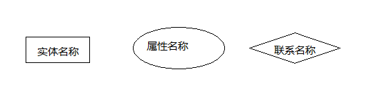

#DBMS是什么？
是一个相互关联的数据的集合和一组用于访问这些数据的程序组成
#DBMS的目的是什么？
基本目标是提供一个可以方便地，有效的存取数据库信息的环境

文件处理系统中存储信息的主要弊端
	
* 数据的冗余和不一致性
* 数据访问困难
* 数据孤立
* 完整性问题
* 原子性问题
* 并发访问异常
* 安全性问题
 
#数据抽象
* 物理层：最低层次的抽象；描述数据实际存储
* 逻辑层：描述数据库中存储什么样的数据，以及数据之间的关系
* 视图层：面向用户应用，使用户与系统的交互更简单

#数据模型
* 基于对象的逻辑模型
		
		实体-联系模型
		面向对象模型
		语义数据模型
		功能数据模型
* 基于记录的逻辑模型
		
		关系模型
		网状模型
		层次模型

#数据库语言

* 数据定义语言（DDL）
* 数据操纵语言（DML）

#事务管理

事务是数据库应用中完成单一逻辑功能的操作集合

#存储管理

存储管理器：在数据库中存储的底层数据与应用程序及向系统提交的查询之间提供接口的程序模块

#数据库管理员

DBA的作用

* 模式定义：创建一系列的定义来创建最初的数据库模式
* 存储结构及存取方式定义：创建一系列定义来创建适当的存储结构和存取模式
* 模式及物理组织的修改
* 数据访问授权
* 完整性约束的定义

#系统总体结构
数据库系统的功能部件大致可以分为查询处理器部件和存储管理器部件

查询处理器部件：

* DML编译器：将查询语言中的DML翻译成查询求值引擎能理解的低级指令
* 嵌入式DML预编译器：将嵌在应用程序中的DML语句转化成宿主语言中的普通的过程调用语言
* DDL解释器
* 查询求值引擎：执行由DML编译器产生的低级指令

存储管理器部件：

* 权限及完整性管理器：检测是否满足完整性约束，检查试图访问数据的用户权限
* 事务管理器：即使发生故障也保证数据的一致性，保证并发任务执行不发生冲突
* 文件管理器：管理磁盘空间分配，用于表示数据库所存储信息的数据结构
* 缓冲管理器：负责将数据从磁盘中取到内存中，并决定哪些数据应该被缓冲存储在内存中。

磁盘存储器：

* 数据文件
* 数据字典
* 索引
* 统计数据：存储关于数据库中数据的统计信息。这些信息被高效地执行查询的方法。

#E-R模型（实体-联系模型）

>在管理信息系统开发中，数据库设计的目标是建立DBMS能识别的关系数据模型。而关系数据模型建立的基础是首先建立E-R模型，通过E-R模型才能转换为关系数据模型。如何建立E-R模型以及如何将E-R模型转换为关系数据模型，是管理信息系统开发中数据库设计的关键。

##什么是E-R模型？
E-R模型即实体-联系模型，E-R模型的提出基于这样一种认识，数据库总是存储现实世界中有意义的数据，而现实世界是由一组实体和实体的联系组，E-R模型可以成功描述数据库所存储的数据。
##为什么要设计E-R模型？
设计E-R模型能够更有效和更好的模拟现实世界。
##E-R模型的基本要素
1) 实体 ：实体是E-R模型的基本对象，是现实世界中各种事物的抽象，凡是可以相互区别，并可以被识别的事、物概念等均可认为是实体。在一个单位中，具有共性的一类实体可以划分为一个实体集，例如，学生李明，黄颖等都是实体，为了便于描述，可以定义学生这样的一个实体集，所有学生都是这个集合的成员。

2)属性：每个实体都具有各种特征，称其为实体的属性，如学生有学号，姓名，年龄等属性。实体的属性值是数据库存储的主要数据。能唯一标识实体的属性或属性组称为实体键，如一个实体有多个键存在。则可从中选取一个作为主键。

3)联系集：实体间会存在各种关系，如人与人之间可能存在领导与雇员关系等，实体间的关系被抽象为联系。

**联系可分为以下 3 种类型：**

(1) 一对一联系(1 ∶1)

　对于实体集A和实体集B来说，如果对于A中的每一个实体a,B中至多有一个实体b与之有联系，而反过来也是如此，则称实体集A与实体集B存在一对一联系。

 例如，一个部门有一个经理，而每个经理只在一个部门任职，则部门与经理的联系是一对一的。

(2) 一对多联系(1 ∶N)

对于实体集A和实体集B来说，如果对于A中的每一个实体a,B中有N个实体b与之有联系，而实体B中每一个实体b,A中至多有一个与之有联系，则称体集A与实体集B存在一对多联系。
 例如，某校一个班级可以有多个学生，但一个学生只能有一个班级

(3) 多对多联系(M ∶N)

对于实体集A和实体集B来说，如果对于A中的每一个实体a,B中有N个实体b与之有联系，而实体B中每一个实体b,A中有M个与之有联系，则称实体集A与实体集B存在多对多联系。

>实体符号用矩形表示，并标以实体名称，属性用椭圆表示，并标以属性名称，联系用菱形表示，并标以联系名称

(1) 一对一联系(1 ∶1)E-R图

 在关系模型中一张二维表格（行，列）对应一个表格，二维表中的每行代表一个实体，每个实体的列代表该实体属性。E-R图最终需要转换为关系模型才有意义。

**将E-R模型转化为关系模型**

1、实体转化为关系　　

实体集转化为关系非常简单，只需将实体的属性作为关系的列即可（实体的所有属性）;

2、联系转化为关系

1）一对一联系需要将其中一个实体的主键作为另一个实体的属性。反映到映射中，将一个关系的主键作为另一个关系的普通列联系本身的属性也应当以列的形式植入。对于一对一关系可将主从关系颠倒，也不会导致信息丢失,可将角色编号作为用户关系中的一个普通列，反过来也可以！

2）一对多联系，需要将一的一方作为主表，多的一方作为从表。联系的所有属性为从表的列，这样才不会导致信息丢失。

　　如学生与班级：学生信息为从表，班级信息为主表
　　
　　
3）一对多。无论联系加入到哪一方都将造成信息丢失。

　　如学生与选课。可以将学号，课程Id，以及关系的属性---学分作为新关系的列

#关系模型

##关系模型研究什么

形象地说，一个关系(relation)就是一个Table

关系模型就是处理Table的，它由三个部分组成: 

* 描述DB各种数据的基本结构形式(Table/Relation) 
- 描述Table与Table之间所可能发生的各种操作(关系运算) 
- 描述这些操作所应遵循的约束条件(完整性约束)

研究的问题是

* Table如何描述？
* 有哪些操作？
* 结果是什么？
* 有哪些约束？

##关系模型的三个要素
基本结构：Relation/Table

基本的 

		∪ (并, UNION)
		- (差, DIFFERENCE)
		Χ (广义积,PRODUCT)
		σ (选择, SELECTION)
		兀 (投影, PROJECTION)
扩展的 

		∩ (交,INTERSECTION)
		▷◁ (连接,JOIN)
		÷ (除, DIVISION)
完整性约束 

		实体完整性
		参照完整性
		用户自定义的完整性

##关系代数

###传统集合运算

传统的集合运算是二目运算，并（∪）、差（−）、交（∩）、笛卡尔积（×）四种运算。

  设关系 R 和关系 S 具有相同的目 n（即两个关系都有 n 个属性），且相应的的属性取自同一个域，t 是元组变量，t∈R 表示 t 是 R 的一个元组。
  下图分别是具有三个属性列的关系 R、S ：
  

- 1.并（union）

关系 R 与关系 S 的并由属于 R 且属于 S 的元组组成。其结果关系仍为 n 目关系。记作：

  下图为关系 R 与关系 S 的并：
  

- 2.差（except）

关系R与关系S的差由属于R而不属于S的所有元组组成。其结果关系仍为n目关系。记作：

  下图为关系R与关系S的差：
  

- 3.交（intersection）

关系R与关系S的交由既属于R又属于S的元组组成。其结果关系仍为n目关系。记作：

下图为关系R与关系S的交：

- 4.笛卡尔积（cartesian product）

这里的笛卡尔积严格地讲是广义笛卡尔积(Extended Cartesian Product)。在不会出现混淆的情况下广义笛卡尔积也称为笛卡尔积。

  两个分别为n目和m目的关系R和S的广义笛卡尔积是一个(n+m)列的元组的集合。元组的前n列是关系R的一个元组，后m列是关系S的一个元组。若R有k1个元组，S有k2个元组，则关系R和关系S的广义笛卡尔积有k1×k2个元组。
  记作：
  

下图为关系R与关系S的笛卡尔积

###专门的关系运算(Specific relation operations)

- 1.选择

选择运算是选择关系中行的子集，即选择满足条件的元组

- 2.投影

投影运算是一元运算，返回作为参数的关系的某些属性，所有的重复行都被去除

- 3.除法运算

除法运算是一个复合的二目运算。如果把笛卡尔积看作“乘法”运算，则除法运算可以看作这个“乘法”的逆运算。

- 4.连接

连接也称为θ连接，关系R与关系S的连接运算是从两个关系的广义笛卡尔积中选取属性间满足一定条件的元组形成一个新的连接：
	
	等值连接（equi join）：θ在“=”时的连接为等值连接。它是从关系R和S的广义笛卡尔积中选取A、B属性值相等的那些元组
	
	自然连接（natural join）：自然连接是一种特殊的等值链接，它要求两个关系中进行比较的分量必须是相同的属性组，并且在结果中把属性重复的列去掉。
	
	左连接（left join）：在自然连接的基础上加上左边表上不包含自然连接中所含元组（行）的元组。
	
	右连接（right join）：在自然连接的基础上加上右边表上不包含自然连接中所含元组（行）的元组。
	
	外连接（outer join）：外连接=左连接+右连接；
	
##关系模型中的完整性约束
###实体完整性
关系的主码中的属性值不能为空值(不知道或无意义的值)。

###参照完整性
如果关系R1的外码Fk与关系R2的主码Pk相对应，则R1中的每一个元组的Fk值或者等于R2中某个元组的Pk值，或者为空值。（简言之，外键要与那张表的主键对应，只能从中取，不能自己造）

###用户自定义完整性
用户针对具体的应用环境定义的完整性约束条件。

比如要求名字在5个 汉字字符之内，年龄在[12, 35]之间，性别只能是“男”或“女”等。

###名词总结

	域(Domain)
		一组值的集合，这组值具有相同的数据类型

		D1=男人集合={夏东海，胡一统}

		D2=女人集合={刘梅，玛丽}

		D3=儿童集合={夏雪, 夏雨, 刘星}

	基数
		集合中元素的个数称为域的基数

		基数就是有多少行。

		D1域的基数为2

		D2域的基数为2

		D3域的基数为3

		笛卡尔积的基数就是2 * 2 * 3 = 12

	笛卡尔积
		所有可能组合成的元组
	元组
		笛卡尔积的每个元素(d1 , d2 , … , dn)称作一个n-元组(n-tuple)

		元组就是一行数据。

		|夏东海|刘梅|夏雪|
	分量
		元组(d1 , d2 , ... , dn)的每一个值di叫做一个分量

		夏东海是一个分量。刘梅是一个分量。夏雪是一个分量。
	关系
		一组域D1 , D2 ,…, Dn的笛卡尔积的子集

		笛卡尔积中具有某一方面意义的那些元组被称作一个关系(Relation)
	属性名
		由于关系的不同列可能来自同一个域，为区分，需要为每一列起一个名字，该名字即为属性名

		原本是男人、女人、儿童，取名为丈夫、妻子、子女。

	关系模式
		关系可用R(A1:D1 , A2:D2 , … , An:Dn )表示，可简记为R(A1 , A2 , … , An )，这种描述又被称为关系模式(Schema)或表标题(head)

	度或目
		n是关系的度或目。 
		男人、女人、儿童，3个度（目）。

###数据库设计三范式

第一范式：当关系模式R的所有属性都不能在分解为更基本的数据单位时，称R是满足第一范式的，简记为1NF。满足第一范式是关系模式规范化的最低要

求，否则，将有很多基本操作在这样的关系模式中实现不了。

第二范式：如果关系模式R满足第一范式，并且R得所有非主属性都完全依赖于R的每一个候选关键属性，称R满足第二范式，简记为2NF。

第三范式：设R是一个满足第一范式条件的关系模式，X是R的任意属性集，如果X非传递依赖于R的任意一个候选关键字，称R满足第三范式，简记为3NF.