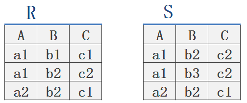
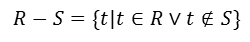

# DBMS是什么？
是一个相互关联的数据的集合和一组用于访问这些数据的程序组成
# DBMS的目的是什么？
基本目标是提供一个可以方便地，有效的存取数据库信息的环境

文件处理系统中存储信息的主要弊端
	
* 数据的冗余和不一致性
* 数据访问困难
* 数据孤立
* 完整性问题
* 原子性问题
* 并发访问异常
* 安全性问题
 
# 数据抽象
* 物理层：最低层次的抽象；描述数据实际存储
* 逻辑层：描述数据库中存储什么样的数据，以及数据之间的关系
* 视图层：面向用户应用，使用户与系统的交互更简单

# 数据模型
* 基于对象的逻辑模型
		
		实体-联系模型
		面向对象模型
		语义数据模型
		功能数据模型
* 基于记录的逻辑模型
		
		关系模型
		网状模型
		层次模型

# 数据库语言

* 数据定义语言（DDL）
* 数据操纵语言（DML）

# 事务管理

事务是数据库应用中完成单一逻辑功能的操作集合

# 存储管理

存储管理器：在数据库中存储的底层数据与应用程序及向系统提交的查询之间提供接口的程序模块

# 数据库管理员

DBA的作用

* 模式定义：创建一系列的定义来创建最初的数据库模式
* 存储结构及存取方式定义：创建一系列定义来创建适当的存储结构和存取模式
* 模式及物理组织的修改
* 数据访问授权
* 完整性约束的定义

# 系统总体结构
数据库系统的功能部件大致可以分为查询处理器部件和存储管理器部件

查询处理器部件：

* DML编译器：将查询语言中的DML翻译成查询求值引擎能理解的低级指令
* 嵌入式DML预编译器：将嵌在应用程序中的DML语句转化成宿主语言中的普通的过程调用语言
* DDL解释器
* 查询求值引擎：执行由DML编译器产生的低级指令

存储管理器部件：

* 权限及完整性管理器：检测是否满足完整性约束，检查试图访问数据的用户权限
* 事务管理器：即使发生故障也保证数据的一致性，保证并发任务执行不发生冲突
* 文件管理器：管理磁盘空间分配，用于表示数据库所存储信息的数据结构
* 缓冲管理器：负责将数据从磁盘中取到内存中，并决定哪些数据应该被缓冲存储在内存中。

磁盘存储器：

* 数据文件
* 数据字典
* 索引
* 统计数据：存储关于数据库中数据的统计信息。这些信息被高效地执行查询的方法。

# E-R模型（实体-联系模型）

>在管理信息系统开发中，数据库设计的目标是建立DBMS能识别的关系数据模型。而关系数据模型建立的基础是首先建立E-R模型，通过E-R模型才能转换为关系数据模型。如何建立E-R模型以及如何将E-R模型转换为关系数据模型，是管理信息系统开发中数据库设计的关键。

## 什么是E-R模型？
E-R模型即实体-联系模型，E-R模型的提出基于这样一种认识，数据库总是存储现实世界中有意义的数据，而现实世界是由一组实体和实体的联系组，E-R模型可以成功描述数据库所存储的数据。
## 为什么要设计E-R模型？
设计E-R模型能够更有效和更好的模拟现实世界。
## E-R模型的基本要素
1) 实体 ：实体是E-R模型的基本对象，是现实世界中各种事物的抽象，凡是可以相互区别，并可以被识别的事、物概念等均可认为是实体。在一个单位中，具有共性的一类实体可以划分为一个实体集，例如，学生李明，黄颖等都是实体，为了便于描述，可以定义学生这样的一个实体集，所有学生都是这个集合的成员。

2)属性：每个实体都具有各种特征，称其为实体的属性，如学生有学号，姓名，年龄等属性。实体的属性值是数据库存储的主要数据。能唯一标识实体的属性或属性组称为实体键，如一个实体有多个键存在。则可从中选取一个作为主键。

3)联系集：实体间会存在各种关系，如人与人之间可能存在领导与雇员关系等，实体间的关系被抽象为联系。

**联系可分为以下 3 种类型：**

(1) 一对一联系(1 ∶1)

　对于实体集A和实体集B来说，如果对于A中的每一个实体a,B中至多有一个实体b与之有联系，而反过来也是如此，则称实体集A与实体集B存在一对一联系。

 例如，一个部门有一个经理，而每个经理只在一个部门任职，则部门与经理的联系是一对一的。

(2) 一对多联系(1 ∶N)

对于实体集A和实体集B来说，如果对于A中的每一个实体a,B中有N个实体b与之有联系，而实体B中每一个实体b,A中至多有一个与之有联系，则称体集A与实体集B存在一对多联系。
 例如，某校一个班级可以有多个学生，但一个学生只能有一个班级

(3) 多对多联系(M ∶N)

对于实体集A和实体集B来说，如果对于A中的每一个实体a,B中有N个实体b与之有联系，而实体B中每一个实体b,A中有M个与之有联系，则称实体集A与实体集B存在多对多联系。

>实体符号用矩形表示，并标以实体名称，属性用椭圆表示，并标以属性名称，联系用菱形表示，并标以联系名称

(1) 一对一联系(1 ∶1)E-R图

 在关系模型中一张二维表格（行，列）对应一个表格，二维表中的每行代表一个实体，每个实体的列代表该实体属性。E-R图最终需要转换为关系模型才有意义。

**将E-R模型转化为关系模型**

1、实体转化为关系　　

实体集转化为关系非常简单，只需将实体的属性作为关系的列即可（实体的所有属性）;

2、联系转化为关系

1）一对一联系需要将其中一个实体的主键作为另一个实体的属性。反映到映射中，将一个关系的主键作为另一个关系的普通列联系本身的属性也应当以列的形式植入。对于一对一关系可将主从关系颠倒，也不会导致信息丢失,可将角色编号作为用户关系中的一个普通列，反过来也可以！

2）一对多联系，需要将一的一方作为主表，多的一方作为从表。联系的所有属性为从表的列，这样才不会导致信息丢失。

　　如学生与班级：学生信息为从表，班级信息为主表
　　
　　
3）一对多。无论联系加入到哪一方都将造成信息丢失。

　　如学生与选课。可以将学号，课程Id，以及关系的属性---学分作为新关系的列

# 关系模型

## 关系模型研究什么

形象地说，一个关系(relation)就是一个Table

关系模型就是处理Table的，它由三个部分组成: 

* 描述DB各种数据的基本结构形式(Table/Relation) 
- 描述Table与Table之间所可能发生的各种操作(关系运算) 
- 描述这些操作所应遵循的约束条件(完整性约束)

研究的问题是

* Table如何描述？
* 有哪些操作？
* 结果是什么？
* 有哪些约束？

## 关系模型的三个要素
基本结构：Relation/Table

基本的 

		∪ (并, UNION)
		- (差, DIFFERENCE)
		Χ (广义积,PRODUCT)
		σ (选择, SELECTION)
		兀 (投影, PROJECTION)
扩展的 

		∩ (交,INTERSECTION)
		▷◁ (连接,JOIN)
		÷ (除, DIVISION)
完整性约束 

		实体完整性
		参照完整性
		用户自定义的完整性

## 关系代数

### 传统集合运算

传统的集合运算是二目运算，并（∪）、差（−）、交（∩）、笛卡尔积（×）四种运算。

  设关系 R 和关系 S 具有相同的目 n（即两个关系都有 n 个属性），且相应的的属性取自同一个域，t 是元组变量，t∈R 表示 t 是 R 的一个元组。
  下图分别是具有三个属性列的关系 R、S ：
  

- 1.并（union）

关系 R 与关系 S 的并由属于 R 且属于 S 的元组组成。其结果关系仍为 n 目关系。记作：

  下图为关系 R 与关系 S 的并：
  

- 2.差（except）

关系R与关系S的差由属于R而不属于S的所有元组组成。其结果关系仍为n目关系。记作：

  下图为关系R与关系S的差：
  

- 3.交（intersection）

关系R与关系S的交由既属于R又属于S的元组组成。其结果关系仍为n目关系。记作：

下图为关系R与关系S的交：

- 4.笛卡尔积（cartesian product）

这里的笛卡尔积严格地讲是广义笛卡尔积(Extended Cartesian Product)。在不会出现混淆的情况下广义笛卡尔积也称为笛卡尔积。

  两个分别为n目和m目的关系R和S的广义笛卡尔积是一个(n+m)列的元组的集合。元组的前n列是关系R的一个元组，后m列是关系S的一个元组。若R有k1个元组，S有k2个元组，则关系R和关系S的广义笛卡尔积有k1×k2个元组。
  记作：
  

下图为关系R与关系S的笛卡尔积

### 专门的关系运算(Specific relation operations)

- 1.选择

选择运算是选择关系中行的子集，即选择满足条件的元组

- 2.投影

投影运算是一元运算，返回作为参数的关系的某些属性，所有的重复行都被去除

- 3.除法运算

除法运算是一个复合的二目运算。如果把笛卡尔积看作“乘法”运算，则除法运算可以看作这个“乘法”的逆运算。

- 4.连接

连接也称为θ连接，关系R与关系S的连接运算是从两个关系的广义笛卡尔积中选取属性间满足一定条件的元组形成一个新的连接：
	
	等值连接（equi join）：θ在“=”时的连接为等值连接。它是从关系R和S的广义笛卡尔积中选取A、B属性值相等的那些元组
	
	自然连接（natural join）：自然连接是一种特殊的等值链接，它要求两个关系中进行比较的分量必须是相同的属性组，并且在结果中把属性重复的列去掉。
	
	左连接（left join）：在自然连接的基础上加上左边表上不包含自然连接中所含元组（行）的元组。
	
	右连接（right join）：在自然连接的基础上加上右边表上不包含自然连接中所含元组（行）的元组。
	
	外连接（outer join）：外连接=左连接+右连接；
	
## 关系模型中的完整性约束
### 实体完整性
关系的主码中的属性值不能为空值(不知道或无意义的值)。

### 参照完整性
如果关系R1的外码Fk与关系R2的主码Pk相对应，则R1中的每一个元组的Fk值或者等于R2中某个元组的Pk值，或者为空值。（简言之，外键要与那张表的主键对应，只能从中取，不能自己造）

### 用户自定义完整性
用户针对具体的应用环境定义的完整性约束条件。

比如要求名字在5个 汉字字符之内，年龄在[12, 35]之间，性别只能是“男”或“女”等。

### 名词总结

	域(Domain)
		一组值的集合，这组值具有相同的数据类型

		D1=男人集合={夏东海，胡一统}

		D2=女人集合={刘梅，玛丽}

		D3=儿童集合={夏雪, 夏雨, 刘星}

	基数
		集合中元素的个数称为域的基数

		基数就是有多少行。

		D1域的基数为2

		D2域的基数为2

		D3域的基数为3

		笛卡尔积的基数就是2 * 2 * 3 = 12

	笛卡尔积
		所有可能组合成的元组
	元组
		笛卡尔积的每个元素(d1 , d2 , … , dn)称作一个n-元组(n-tuple)

		元组就是一行数据。

		|夏东海|刘梅|夏雪|
	分量
		元组(d1 , d2 , ... , dn)的每一个值di叫做一个分量

		夏东海是一个分量。刘梅是一个分量。夏雪是一个分量。
	关系
		一组域D1 , D2 ,…, Dn的笛卡尔积的子集

		笛卡尔积中具有某一方面意义的那些元组被称作一个关系(Relation)
	属性名
		由于关系的不同列可能来自同一个域，为区分，需要为每一列起一个名字，该名字即为属性名

		原本是男人、女人、儿童，取名为丈夫、妻子、子女。

	关系模式
		关系可用R(A1:D1 , A2:D2 , … , An:Dn )表示，可简记为R(A1 , A2 , … , An )，这种描述又被称为关系模式(Schema)或表标题(head)

	度或目
		n是关系的度或目。 
		男人、女人、儿童，3个度（目）。

### 数据库设计三范式

第一范式：当关系模式R的所有属性都不能在分解为更基本的数据单位时，称R是满足第一范式的，简记为1NF。满足第一范式是关系模式规范化的最低要求，否则，将有很多基本操作在这样的关系模式中实现不了。（无重复的列）

	所谓第一范式（1NF）是指数据库表的每一列都是不可分割的基本数据项，同一列中不能有多个值，即实体中的某个属性不能有多个值或者不能有重复的属性。如果出现重复的属性，就可能需要定义一个新的实体，新的实体由重复的属性构成，新实体与原实体之间为一对多关系。在第一范式（1NF）中表的每一行只包含一个实例的信息。简而言之，第一范式就是无重复的列。

第二范式：如果关系模式R满足第一范式，并且R得所有非主属性都完全依赖于R的每一个候选关键属性，称R满足第二范式，简记为2NF。（属性完全依赖于主键）
	
	第二范式（2NF）是在第一范式（1NF）的基础上建立起来的，即满足第二范式（2NF）必须先满足第一范式（1NF）。第二范式（2NF）要求数据库表中的每个实例或行必须可以被惟一地区分。为实现区分通常需要为表加上一个列，以存储各个实例的惟一标识。例如员工信息表中加上了员工编号（emp_id）列，因为每个员工的员工编号是惟一的，因此每个员工可以被惟一区分。这个惟一属性列被称为主关键字或主键、主码。 
    第二范式（2NF）要求实体的属性完全依赖于主关键字。所谓完全依赖是指不能存在仅依赖主关键字一部分的属性，如果存在，那么这个属性和主关键字的这一部分应该分离出来形成一个新的实体，新实体与原实体之间是一对多的关系。为实现区分通常需要为表加上一个列，以存储各个实例的惟一标识。简而言之，第二范式就是属性完全依赖于主键。

第三范式：设R是一个满足第一范式条件的关系模式，X是R的任意属性集，如果X非传递依赖于R的任意一个候选关键字，称R满足第三范式，简记为3NF.

	第三范式就是属性不依赖于其它非主属性。 也就是说， 如果存在非主属性对于码的传递函数依赖，则不符合3NF的要求。
	
	
# mysql

	
	
大体来说，MySQL 可以分为 Server 层和存储引擎层两部分。

Server 层包括连接器、查询缓存、分析器、优化器、执行器等，涵盖 MySQL 的大多数核心服务功
能，以及所有的内置函数（如日期、时间、数学和加密函数等），所有跨存储引擎的功能都在这一
层实现，比如存储过程、触发器、视图等。

而存储引擎层负责数据的存储和提取。其架构模式是插件式的，支持 InnoDB、MyISAM、Memory
等多个存储引擎。现在最常用的存储引擎是 InnoDB，它从 MySQL 5.5.5 版本开始成为了默认存储
引擎。

## 查询流程

### 1.连接器

连接器负责跟客户端建立连接、获取权限、维持和管理连接。

	如果用户名密码认证通过，连接器会到权限表里面查出你拥有的权限。之后，这个连接里面的权限判断逻辑，都将依赖于此时读到的权限。

客户端如果太长时间没动静，连接器就会自动将它断开。这个时间是由参数 wait_timeout 控制的，
默认值是 8 小时。

### 2.查询缓存

连接建立完成后，你就可以执行 select 语句了。执行逻辑就会来到第二步：查询缓存。

MySQL 拿到一个查询请求后，会先到查询缓存看看，之前是不是执行过这条语句。之前执行过的语
句及其结果可能会以 key-value 对的形式，被直接缓存在内存中。key 是查询的语句，value 是查
询的结果。如果你的查询能够直接在这个缓存中找到 key，那么这个 value 就会被直接返回给客户
端。

如果语句不在查询缓存中，就会继续后面的执行阶段。执行完成后，执行结果会被存入查询缓存
中。你可以看到，如果查询命中缓存，MySQL 不需要执行后面的复杂操作，就可以直接返回结果，
这个效率会很高。

**但是大多数情况下我会建议你不要使用查询缓存，为什么呢？因为查询缓存往往弊大于利。**

查询缓存的失效非常频繁，只要有对一个表的更新，这个表上所有的查询缓存都会被清空。因此很
可能你费劲地把结果存起来，还没使用呢，就被一个更新全清空了。对于更新压力大的数据库来
说，查询缓存的命中率会非常低。除非你的业务就是有一张静态表，很长时间才会更新一次。比
如，一个系统配置表，那这张表上的查询才适合使用查询缓存。

需要注意的是，MySQL 8.0 版本直接将查询缓存的整块功能删掉了，也就是说 8.0 开始彻底没有这
个功能了。

#### 3.分析器

分析器先会做“词法分析”。你输入的是由多个字符串和空格组成的一条 SQL 语句，MySQL 需要识
别出里面的字符串分别是什么，代表什么。

#### 4.优化器

优化器是在表里面有多个索引的时候，决定使用哪个索引；或者在一个语句有多表关联（join）的时
候，决定各个表的连接顺序。

#### 5.执行器

打开表的时候，执行器就会根据表的引擎定义，去使用这个引擎提供的接口。

	select * from T where ID=10;
	
比如我们这个例子中的表 T 中，ID 字段没有索引，那么执行器的执行流程是这样的：

1. 调用 InnoDB 引擎接口取这个表的第一行，判断 ID 值是不是 10，如果不是则跳过，如果是则将
这行存在结果集中；
2. 调用引擎接口取“下一行”，重复相同的判断逻辑，直到取到这个表的最后一行。
3. 执行器将上述遍历过程中所有满足条件的行组成的记录集作为结果集返回给客户端。

至此，这个语句就执行完成了。

对于有索引的表，执行的逻辑也差不多。第一次调用的是“取满足条件的第一行”这个接口，之后循
环取“满足条件的下一行”这个接口，这些接口都是引擎中已经定义好的。

你会在数据库的慢查询日志中看到一个 rows_examined 的字段，表示这个语句执行过程中扫描了多
少行。这个值就是在执行器每次调用引擎获取数据行的时候累加的。

在有些场景下，执行器调用一次，在引擎内部则扫描了多行，因此引擎扫描行数跟 rows_examined
并不是完全相同的。我们后面会专门有一篇文章来讲存储引擎的内部机制，里面会有详细的说明。

## 更新流程

	update T set c=c+1 where ID=2;

###重要的日志模块：redo log

WAL 技术

WAL（Write-Ahead Logging）：它的关键点就是先写日志，再写磁盘。

InnoDB 的 redo log 是固定大小的，比如可以配置为一组 4 个文件，每个文件的大小是 1GB，那么
这块“粉板”总共就可以记录 4GB 的操作。从头开始写，写到末尾就又回到开头循环写，如下面这个
图所示。

write pos 是当前记录的位置，一边写一边后移，写到第 3 号文件末尾后就回到 0 号文件开头。
checkpoint 是当前要擦除的位置，也是往后推移并且循环的，擦除记录前要把记录更新到数据文
件。

write pos 和 checkpoint 之间的是“粉板”上还空着的部分，可以用来记录新的操作。如果 write
pos 追上 checkpoint，表示“粉板”满了，这时候不能再执行新的更新，得停下来先擦掉一些记录，
把 checkpoint 推进一下。

有了 redo log，InnoDB 就可以保证即使数据库发生异常重启，之前提交的记录都不会丢失，这个能
力称为crash-safe。

###重要的日志模块：binlog

server 层的日志binlog（归档日志）

redo log和binlog的区别

1. redo log 是 InnoDB 引擎特有的；binlog 是 MySQL 的 Server 层实现的，所有引擎都可以使
用。
2. redo log 是物理日志，记录的是“在某个数据页上做了什么修改”；binlog 是逻辑日志，记录的是
这个语句的原始逻辑，比如“给 ID=2 这一行的 c 字段加 1 ”。
3. redo log 是循环写的，空间固定会用完；binlog 是可以追加写入的。“追加写”是指 binlog 文件
写到一定大小后会切换到下一个，并不会覆盖以前的日志。

**执行更新流程**

1. 执行器先找引擎取 ID=2 这一行。ID 是主键，引擎直接用树搜索找到这一行。如果 ID=2 这一行
所在的数据页本来就在内存中，就直接返回给执行器；否则，需要先从磁盘读入内存，然后再返
回。
2. 执行器拿到引擎给的行数据，把这个值加上 1，比如原来是 N，现在就是 N+1，得到新的一行数
据，再调用引擎接口写入这行新数据。
3. 引擎将这行新数据更新到内存中，同时将这个更新操作记录到 redo log 里面，此时 redo log 处
于 prepare 状态。然后告知执行器执行完成了，随时可以提交事务。
4. 执行器生成这个操作的 binlog，并把 binlog 写入磁盘。
5. 执行器调用引擎的提交事务接口，引擎把刚刚写入的 redo log 改成提交（commit）状态，更新
完成。

将redo log的写入拆成两个步骤：prepare 和 commit，这就是"两阶段提交"。

### 为什么需要两阶段提交

仍然用前面的 update 语句来做例子。假设当前 ID=2 的行，字段 c 的值是 0，再假设执行 update
语句过程中在写完第一个日志后，第二个日志还没有写完期间发生了 crash，会出现什么情况呢？

1. 先写 redo log 后写 binlog。假设在 redo log 写完，binlog 还没有写完的时候，MySQL 进程异
常重启。由于我们前面说过的，redo log 写完之后，系统即使崩溃，仍然能够把数据恢复回来，
所以恢复后这一行 c 的值是 1。
但是由于 binlog 没写完就 crash 了，这时候 binlog 里面就没有记录这个语句。因此，之后备份
日志的时候，存起来的 binlog 里面就没有这条语句。
然后你会发现，如果需要用这个 binlog 来恢复临时库的话，由于这个语句的 binlog 丢失，这个
临时库就会少了这一次更新，恢复出来的这一行 c 的值就是 0，与原库的值不同。
2. 先写 binlog 后写 redo log。如果在 binlog 写完之后 crash，由于 redo log 还没写，崩溃恢复
以后这个事务无效，所以这一行 c 的值是 0。但是 binlog 里面已经记录了“把 c 从 0 改成 1”这
个日志。所以，在之后用 binlog 来恢复的时候就多了一个事务出来，恢复出来的这一行 c 的值
就是 1，与原库的值不同。

可以看到，如果不使用“两阶段提交”，那么数据库的状态就有可能和用它的日志恢复出来的库的状
态不一致。

## 事务

> 事务：一个最小的不可再分的工作单元；通常一个事务对应一个完整的业务(例如银行账户转账业务，该业务就是一个最小的工作单元)

> 一个完整的业务需要批量的DML(insert、update、delete)语句共同联合完成

>事务只和DML语句有关，或者说DML语句才有事务。这个和业务逻辑有关，业务逻辑不同，DML语句的个数不同

### 事务的特性ACID

- Atomicity：原子性
- Consistency：一致性
- Isolation：隔离性
- Durability：持久性

多个事务同时执行的时候，就可能出现

脏读（dirty read）: 脏读是指在一个事务处理过程里读取了另一个未提交的事务中的数据;

不可重复读（non-repeatableread）: 不可重复读是指在对于数据库中的某个数据，一个事务范围内多次查询却返回了不同的数据值，这是由于在查询间隔，被另一个事务修改并提交了。

幻读（phantom read）: 幻读是事务非独立执行时发生的一种现象。例如事务T1对一个表中所有的行的某个数据项做了从“1”修改为“2”的操作，这时事务T2又对这个表中插入了一行数据项，而这个数据项的数值还是为“1”并且提交给数据库。而操作事务T1的用户如果再查看刚刚修改的数据，会发现还有一行没有修改，其实这行是从事务T2中添加的，就好像产生幻觉一样，这就是发生了幻读。

　　幻读和不可重复读都是读取了另一条已经提交的事务（这点就脏读不同），所不同的是不可重复读查询的都是同一个数据项，而幻读针对的是一批数据整体（比如数据的个数）。

### 隔离性与隔离级别

> 多个事务同时执行的时候，就可能出现脏读（dirty read）、不可重复读（non-repeatable
read）、幻读（phantom read）的问题，为了解决这些问题，就出现了隔离级别的概念

SQL标准的事务隔离级别包括

- 读未提交（read uncommitted）

		读未提交是指，一个事务还没提交时，它做的变更就能被别的事务看到。
		
		最低级别，任何情况都无法保证。

- 读提交（read committed）

		读提交是指，一个事务提交之后，它做的变更才会被其他事务看到。
		
		可避免脏读的发生。

- 可重复读（repeatable read）

		可重复读是指，一个事务执行过程中看到的数据，总是跟这个事务在启动时看到的数据是一致的。当然在可重复读隔离级别下，未提交变更对其他事务也是不可见的。
		
		可避免脏读、不可重复读的发生。
- 串行化（serializable ）

		串行化，顾名思义是对于同一行记录，“写”会加“写锁”，“读”会加“读锁”。当出现读写锁冲突的时候，后访问的事务必须等前一个事务执行完成，才能继续执行。
		
		可避免脏读、不可重复读、幻读的发生
		
		
我用一个例子说明这几种隔离级别。假设数据表 T 中只有一列，其中一行的值为 1，下面是按照时
间顺序执行两个事务的行为。

- 若隔离级别是“读未提交”， 则 V1 的值就是 2。这时候事务 B 虽然还没有提交，但是结果已经被
A 看到了。因此，V2、V3 也都是 2。

- 若隔离级别是“读提交”，则 V1 是 1，V2 的值是 2。事务 B 的更新在提交后才能被 A 看到。所
以， V3 的值也是 2。

- 若隔离级别是“可重复读”，则 V1、V2 是 1，V3 是 2。之所以 V2 还是 1，遵循的就是这个要
求：事务在执行期间看到的数据前后必须是一致的。

- 若隔离级别是“串行化”，则在事务 B 执行“将 1 改成 2”的时候，会被锁住。直到事务 A 提交后，
事务 B 才可以继续执行。所以从 A 的角度看， V1、V2 值是 1，V3 的值是 2。

### 事务隔离的实现（可重复读）

在 MySQL 中，实际上每条记录在更新的时候都会同时记录一条回滚操作。记录上的最新值，通过
回滚操作，都可以得到前一个状态的值。

假设一个值从 1 被按顺序改成了 2、3、4，在回滚日志里面就会有类似下面的记录。

当前值是 4，但是在查询这条记录的时候，不同时刻启动的事务会有不同的 read-view。如图中看
到的，在视图 A、B、C 里面，这一个记录的值分别是 1、2、4，同一条记录在系统中可以存在多个
版本，就是数据库的多版本并发控制（MVCC）。对于 read-view A，要得到 1，就必须将当前值依
次执行图中所有的回滚操作得到。

### 事务的启动方式

1. 用 BEGIN, ROLLBACK, COMMIT来实现

	BEGIN 开始一个事务

	ROLLBACK 事务回滚

	COMMIT 事务确认

2. 直接用 SET 来改变 MySQL 的自动提交模式:

	SET AUTOCOMMIT=0 禁止自动提交

	SET AUTOCOMMIT=1 开启自动提交

		mysql> use RUNOOB;
		Database changed
		mysql> CREATE TABLE runoob_transaction_test( id int(5)) engine=innodb;  # 创建数据表
		Query OK, 0 rows affected (0.04 sec)
 
		mysql> select * from runoob_transaction_test;
		Empty set (0.01 sec)
 
		mysql> begin;  # 开始事务
		Query OK, 0 rows affected (0.00 sec)
 
		mysql> insert into runoob_transaction_test value(5);
		Query OK, 1 rows affected (0.01 sec)
 
		mysql> insert into runoob_transaction_test value(6);
		Query OK, 1 rows affected (0.00 sec)
 
		mysql> commit; # 提交事务
		Query OK, 0 rows affected (0.01 sec)
 
		mysql>  select * from runoob_transaction_test;
		+------+
		| id   |
		+------+
		| 5    |
		| 6    |
		+------+
		2 rows in set (0.01 sec)
 
		mysql> begin;    # 开始事务
		Query OK, 0 rows affected (0.00 sec)
 
		mysql>  insert into runoob_transaction_test values(7);
		Query OK, 1 rows affected (0.00 sec)
 
		mysql> rollback;   # 回滚
		Query OK, 0 rows affected (0.00 sec)
 
		mysql>   select * from runoob_transaction_test;   # 因为回滚所以数据没有插入
		+------+
		| id   |
		+------+
		| 5    |
		| 6    |
		+------+
		2 rows in set (0.01 sec)
 
		mysql>

可以在 information_schema 库的 innodb_trx 这个表中查询长事务，比如下面这个语句，用于查找
持续时间超过 60s 的事务。

	select * from information_schema.innodb_trx where TIME_TO_SEC(timediff(now(),trx_started))>60

## 索引

>索引的出现其实就是为了提高数据查询的效率，就像书的目录一样

### 索引模型

#### 1.哈希表
哈希表这种结构适用于只有等值查询的场景

#### 2.有序数组
有序数组在等值查询和范围查询场景中的性能就都非常优秀

如果仅仅看查询效率，有序数组就是最好的数据结构了。但是，在需要更新数据的时候就麻烦了，
你往中间插入一个记录就必须得挪动后面所有的记录，成本太高。

所以，有序数组索引只适用于静态存储引擎，比如你要保存的是 2017 年某个城市的所有人口信息，
这类不会再修改的数据。

#### 3.搜索树

二叉搜索树也是课本里的经典数据结构了。还是上面根据身份证号查名字的例子，如果我们用二叉
搜索树来实现的话，示意图如下所示：

二叉搜索树的特点是：每个节点的左儿子小于父节点，父节点又小于右儿子。这样如果你要查
ID_card_n2 的话，按照图中的搜索顺序就是按照 UserA -> UserC -> UserF -> User2 这个路径
得到。这个时间复杂度是 O(log(N))。

当然为了维持 O(log(N)) 的查询复杂度，你就需要保持这棵树是平衡二叉树。为了做这个保证，更
新的时间复杂度也是 O(log(N))。

树可以有二叉，也可以有多叉。多叉树就是每个节点有多个儿子，儿子之间的大小保证从左到右递
增。二叉树是搜索效率最高的，但是实际上大多数的数据库存储却并不使用二叉树。其原因是，索
引不止存在内存中，还要写到磁盘上。

你可以想象一下一棵 100 万节点的平衡二叉树，树高 20。一次查询可能需要访问 20 个数据块。在
机械硬盘时代，从磁盘随机读一个数据块需要 10 ms 左右的寻址时间。也就是说，对于一个 100 万
行的表，如果使用二叉树来存储，单独访问一个行可能需要 20 个 10 ms 的时间，这个查询可真够
慢的。