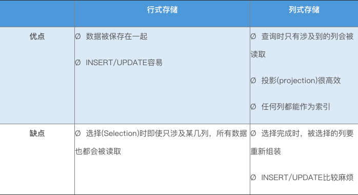
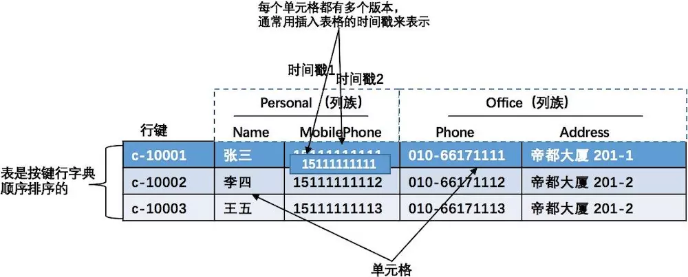

# 科德十二定律

>科德十二定律是由关系型数据库理论奠基者埃德加·科德（Edgar Codd）为保持其关系数据库构想的完整性而提出的，被普遍认为是全关系系统必须遵循的基本准则。

## 1.第零准则（The foundation rule：）

	Rule 0: For any system that is advertised as, or claimed to be, a relational data base management system, that system must be able to manage data bases entirely through its relational capabilities. 

所有称作关系数据库管理系统（RDBMS）的系统必须能够完全通过它自身的关系能力来管理数据库。

## 2.第一准则：信息准则（The information rule: ）

	Rule 1: All information in a relational data base is represented explicitly at the logical level and in exactly one way — by values in tables.

关系数据库中的所有信息都应该在逻辑层面上通过表格中的数值清晰地表示出来。

## 3.第二准则：保证访问准则（The guaranteed access rule:）

	Rule 2: Each and every datum (atomic value) in a relational data base is guaranteed to be logically accessible by resorting to a combination of table name, primary key value and column name.

关系数据库中的每一个内容应保证能够通过表格名称、列名称和主码的组合获得。

## 3.第三准则 空值的系统化处理 （Systematic treatment of null values: ）

	Rule 3: Null values (distinct from the empty character string or a string of blank characters and distinct from zero or any other number) are supported in fully relational DBMS for representing missing information and inapplicable information in a systematic way, independent of data type. 

空值【区分于空字符串、空白字符组成的字符串和其他数字】在完全关系数据库系统中是支持的，它可以通过一个系统的方法，独立于数据类型地表示缺失数据和无法获取的数据。

## 4.第四准则：基于关系模型的动态的联机数据字典 （Dynamic online catalog based on the relational model:）

	Rule 4: The data base description is represented at the logical level in the same way as ordinary data, so that authorized users can apply the same relational language to its interrogation as they apply to the regular data. 
数据库的表述应该在逻辑层面和普通数据有相同的表示方式，这样被授权的用户就可以在调查数据的时候使用与对于普通数据的操作相同的关系型语言

## 5.第五准则：统一的数据子语言 （The comprehensive data sublanguage rule: ）

	Rule 5: A relational system may support several languages and various modes of terminal use (for example, the fill-in-the-blanks mode). However, there must be at least one language whose statements are expressible, per some well-defined syntax, as character strings and that is comprehensive in supporting all of the following items:
	
关系数据库系统可以支持多种语言以及多种模式的终端操作。然而它必须具备一种可以通过定义十分完善的语句作为字符串来表述的特性，而且可以实现以下所有的特性：

* Data definition.（数据的定义）
* View definition.（视图的定义）
* Data manipulation (interactive and by program).（与程序交互实现的数据处理）
* Integrity constraints.（完整性的约束条件）
* Authorization.（授权性）
* Transaction boundaries (begin, commit and rollback).（处理事项的规定界限）

## 6.第六准则：视图更新准则（The view updating rule: ）

	Rule 6: All views that are theoretically updatable are also updatable by the system. 
	
所有理论证明可以实现的视图，均可以通过系统更新得到。

## 7.第七准则：高级的插入、修改和删除操作（Possible for high-level insert, update, and delete: ）

	Rule 7: The capability of handling a base relation or a derived relation as a single operand applies not only to the retrieval of data but also to the insertion, update and deletion of data. 
	
通过一个关于数据库关系或派生的关系的操作码，不仅可以数据的检索，还可以实现数据的插入、更新和删除。

## 8.第八准则：数据的物理独立性（Physical data independence: ）

	Rule 8: Application programs and terminal activities remain logically unimpared whenever any changes are made in either storage representations or access methods. 

不论存储表示或者存取方法怎样变化，应用程序和终端活动应该在逻辑层面上保持不变。

## 9.第九准则：数据逻辑独立性（Logical data independence: ）

	Rule 9: Application programs and terminal activites remain logically unimpared when information-preserving changes of any kind that theoretically permit unimpairment are made to the base tables. 

当任何种类的保存数据的操作在理论层面不受损害之时，应用程序和终端操作应保持数据不变性。

## 10.第十准则：数据完整的独立性 （Integrity independence: ）

	Rule 10: Integrity constraints specific to a particular relational data base must be definable in the relational data sublanguage and storable in the catalog, not in the application programs. 
	
对于特定关系型数据库的完整性约束条件，必须对于关系型数据的亚语言是可以定义的，而且是可以存储在目录而不是应用程序中的。

## 11.第十一准则：分布独立性（Distribution independence: ）

	Rule 11: A relational DBMS has distribution independence.
	
关系式数据库系统具有分布独立性。
	
分布独立性意味着数据库系统具有数据亚语言，可以保持应用程序和终端活动在以下情形不会破坏数据库的逻辑构造：

* 当数据分布首次开始启动的时候（原本的数据库系统只操作非分布式数据）；
* 当数据被再次分布之时（若数据库系统操作分布式数据）

## 12.第十二准则：无破坏准则（The nonsubversion rule: ）

	Rule 12: If a relational system has a low-level (single-record-at-a-time) language, that low level cannot be used to subvert or bypass the integrity rules and constraints expressed in the higher level relational language (multiple-records-at-a-time). 

如果关系数据库具有一个一次只能处理一个数据的低级语言，其不能违反完整性准则和高级关系语言表达的约束

# MPP（Massively Parallel Processing）数据库
* MPP大规模并行处理

# 列式存储（column-oriented）数据库

* 列式存储数据库：以列为单位聚合数据，然后将列值顺序地存入磁盘
* 行式存储数据库：连续的存储整行
* HBase与传统列式数据库的相同之处：使用了磁盘上的列式存储格式
* HBase与传统列式数据库的不同之处：传统的列式数据库适合实时存取数据的场景，HBase比较适合键值对的数据存取或者有序的数据存取。

# 传统的实时数据存取场景和键值对的数据存储场景有什么区别

	不像关系型数据库，键值对存储不须要了解值中的数据，也没有像MySQL或者PostgreSQL中那样的不论什么结构。

	这同一时候表示像SQL那样用WHERE语句或者通过不论什么形式的过滤来请求数据中的一部分是无法做到的。假设你不知道去哪找。你必须遍历全部的键。获取它们相应的值，应用某种你须要的过滤，然后保留你想要的东西。

	这将会须要大量的运算，也即表示仅仅有当键已知的时候才干体现出最佳性能，否则键值对存储将无法胜任（注意：一些键值对存储可以存储结构化的数据并有字段索引）。

	因此。即使键值对存储在訪问速度上常常比关系型数据库系统性能要好数个数量级，但对键已知的需求也限制着其应用。

# 传统关系型数据库
* 事务：

		事务提供了原子性跨表更新数据的特性；
**事务的ACID特性：**

* 原子性（Atomicity）

		原子性是指事务是一个不可分割的工作单位，事务中的操作要么都发生，要么都不发生。
* 一致性（Consistency）

		事务前后数据的完整性必须保持一致。
* 隔离性（Isolation）

		事务的隔离性是多个用户并发访问数据库时，数据库为每一个用户开启的事务，不能被其他事务的操作数据所干扰，多个并发事务之间要相互隔离。
* 持久性（Durability）

		持久性是指一个事务一旦被提交，它对数据库中数据的改变就是永久性的，接下来即使数据库发生故障也不应该对其有任何影响

# 区分系统特定优势的维度
### 1.数据模型
数据有很多存储方式

* 键/值对存储
* 半结构化的列式存储
* 文档结构存储
* 结构化的行式存储

### 2.存储模型

* 内存模式
* 持久化存储数据到磁盘

### 3.一致性模型

* 严格一致性
* 顺序一致性
* 因果一致性
* 最终一致性
* 弱一致性

### 4.物理模型
* 分布式
* 单机

### 5.读写性能

* 读多写少
* 读写相当
* 写多读少
* 范围扫描
* 随即读

### 6.辅助索引

### 7.故障处理

### 8.压缩

### 9.负载均衡

### 10.原子操作的读-修改-写

### 11.加锁，等待和死锁

# 行式存储和列式存储

* 行式存储（Row-basedstorage）
	Row-based storage stores a table in a sequence of rows. 
* 列式存储（Columnar or column-based）
	Column-based storage stores a table in a sequence of columns.
	

## 1.行式存储和列式存储的比较

## 2.数据压缩
通过字典表压缩数据

## 3.查询执行性能

关键步骤如下：

1.     1.去字典表里找到字符串对应数字(只进行一次字符串比较)。

2.     2.用数字去列表里匹配，匹配上的位置设为1。

3.     3.把不同列的匹配结果进行位运算得到符合所有条件的记录下标。

4.     4.使用这个下标组装出最终的结果集。

# HBASE数据存储模型

>HBase数据存储结构中主要包括：表、行、列族、列限定符、单元格和时间戳

- 表： 表的作用将存储在HBase的数据组织起来。

- 行： 行包含在表中，数据以行的形式存储在HBase的表中。HBase的表中的每一行数据都会被一个唯一标识的行键标识。行键没有数据类型，在HBase存储系统中行键总是被看作一个byte数组。

- 列族： 在行中的数据都是根据列族分组，由于列族会影响存储在HBase中的数据的物理布置，所以列族会在使用前定义（在定义表的时候就定义列族），并且不易被修改。
在HBase的存储系统中数据存储在相同的表中的所有行的数据都会有相同的列族（这和关系型数据库的表一样，每一行数据都有相同的列）。

- 列限定符： 存储在在列族中的数据通过列限定符或列来寻址的，列不需要提前定义（不需要在定义表和列族的时候就定义列），列与列之间也不需要保持一致。列和行键一样没有数据类型，并且在HBase存储系统中列也总是被看作一个byte数组。

- 单元格： 根据行键、列族和列可以映射到一个对应的单元格，单元格是HBase存储数据的具体地址。在单元格中存储具体数据都是以Byte数组的形式存储的，也没有具体的数据类型。

- 时间戳： 时间戳是给定值的一个版本号标识，每一个值都会对应一个时间戳，时间戳是和每一个值同时写入HBase存储系统中的。在默认情况下，时间戳表示数据服务在写入数据时的时间，但可以在将数据放入单元格时指定不同的时间戳值。

## 表的组织结构

图一HBase中的一个表，由两个列族（Personal和Office）组成，每个列族都有两列。 包含数据的实体称为单元格,行根据行键进行排序。

为了更好的理解HBase中的多维数据存储模型，这里从上图的表中摘出一条数据，将它在HBase的表中的存储转化成如图二所表示的形式去理解他。

如果将HBase表中的数据理解成键值对存储的形式,那么也可以用如图三的形式来理解存储在HBase表中的数据。

**HBASE设计要点**

- 行键是HBase表结构设计中最重要的一件事情，行键决定了应用程序如何与HBase表进行交互。如果没设计好行键还会影响从HBase中读出数据的性能。

- HBase的表结构很灵活，而且不关心数据类型，你可以以byte数组的形式存储任何数据。

- 存储在相同的列族中的数据具有相同的特性（易于理解）。

- HBase主要是通过行键来建立索引。

- HBase不支持多行事务，所有尽量在一次API请求操作中获取到结果。

- HBase中的键可以通过提取其hash值来保证键长度是固定的和均匀分布，但是这样做会牺牲键的数据排序和可读性。

- 列限定符和列族名字的长度都会影响I/O的读写性能和发送给客户端的数据量，所以给它们命名的时候应该尽量简短！

## HBASE操作命令

### 进入shell

		hbase shell
		
		创建命名空间
		create_namespace 'database'
### 表结构
1. 创建表

		语法 ：create <table>, {NAME => <family>, VERSIONS => <VERSIONS>}
		
		hbase(main):002:0> create 'User','info'
		0 row(s) in 1.5890 seconds

		=> Hbase::Table - User
		创建表两个列族
		create 'database:somebody',  {NAME=>'personal'},{NAME=>'office'}

2. 查看所有表

		hbase(main):003:0> list
		TABLE
		SYSTEM.CATALOG
		SYSTEM.FUNCTION
		SYSTEM.SEQUENCE
		SYSTEM.STATS
		TEST.USER
		User
		6 row(s) in 0.0340 seconds

		=> ["SYSTEM.CATALOG", "SYSTEM.FUNCTION", "SYSTEM.SEQUENCE", "SYSTEM.STATS", "TEST.USER", "User"]

3. 查看表详情

		hbase(main):004:0> describe 'User'
		Table User is ENABLED
		User
		COLUMN FAMILIES DESCRIPTION
		{NAME => 'info', BLOOMFILTER => 'ROW', VERSIONS => '1', IN_MEMORY => 'false', KEEP_DELETED_CELLS => 'FALSE', DATA_BLOCK_ENCODING => 'NONE', TTL => 'FORE
		VER', COMPRESSION => 'NONE', MIN_VERSIONS => '0', BLOCKCACHE => 'true', BLOCKSIZE => '65536', REPLICATION_SCOPE => '0'}
		1 row(s) in 0.1410 seconds

		hbase(main):025:0> desc 'User'
		Table User is ENABLED
		User
		COLUMN FAMILIES DESCRIPTION
		{NAME => 'info', BLOOMFILTER => 'ROW', VERSIONS => '1', IN_MEMORY => 'false', KEEP_DELETED_CELLS => 'FALSE', DATA_BLOCK_ENCODING => 'NONE', TTL => 'FORE
		VER', COMPRESSION => 'NONE', MIN_VERSIONS => '0', BLOCKCACHE => 'true', BLOCKSIZE => '65536', REPLICATION_SCOPE => '0'}
		1 row(s) in 0.0380 seconds
		
4. 表修改

	删除指定的列族
	
		hbase(main):002:0> alter 'User', 'delete' => 'info'
		Updating all regions with the new schema...
		1/1 regions updated.
		Done.
		0 row(s) in 2.5340 seconds

### 表数据

1. 插入数据

	在向HBase的表中添加数据的时候，只能一列一列的添加，不能同时添加多列

		语法：put <table>,<rowkey>,<family:column>,<value>
		hbase(main):005:0> put 'User', 'row1', 'info:name', 'xiaoming'
		0 row(s) in 0.1200 seconds

		hbase(main):006:0> put 'User', 'row2', 'info:age', '18'
		0 row(s) in 0.0170 seconds

		hbase(main):007:0> put 'User', 'row3', 'info:sex', 'man'
		0 row(s) in 0.0030 seconds
		
		put 'database:somebody','c-10001','personal:name','张三'
		put 'database:somebody','c-10001','personal:mobilephone','15111111111'
		put 'database:somebody','c-10001','office:phone','010-66171111'
		put 'database:somebody','c-10001','office:address','帝都大厦 201-1'
		
		put 'database:somebody','c-10002','personal:name','李四'
		put 'database:somebody','c-10002','personal:mobilephone','15111111112'
		put 'database:somebody','c-10002','office:phone','010-66171112'
		put 'database:somebody','c-10002','office:address','帝都大厦 201-2'
		
2. 根据rowKey查询某个记录

		语法：get <table>,<rowkey>,[<family:column>,....]
		
		hbase(main):008:0> get 'User', 'row2'
		COLUMN                                  CELL
		info:age                               timestamp=1502368069926, value=18
		1 row(s) in 0.0280 seconds
		hbase(main):028:0> get 'User', 'row3', 'info:sex'
		COLUMN                                  CELL
		info:sex                               timestamp=1502368093636, value=man

		hbase(main):036:0> get 'User', 'row1', {COLUMN => 'info:name'}
		COLUMN                                  CELL
		info:name                              timestamp=1502368030841, value=xiaoming
		1 row(s) in 0.0120 seconds
		
		get 'database:somebody','c-10002',['personal:name','personal:mobilephone']
		
3. 查询所有记录

		语法：scan <table>, {COLUMNS => [ <family:column>,.... ], LIMIT => num}
扫描所有记录

		hbase(main):009:0> scan 'User'
		ROW                                     COLUMN+CELL
		row1                                   column=info:name, timestamp=1502368030841, value=xiaoming
		row2                                   column=info:age, timestamp=1502368069926, value=18
		row3                                   column=info:sex, timestamp=1502368093636, value=man
		3 row(s) in 0.0380 seconds
		
	扫描前2条

		hbase(main):037:0> scan 'User', {LIMIT => 2}
		ROW                                     COLUMN+CELL
		row1                                   column=info:name, timestamp=1502368030841, value=xiaoming
		row2                                   column=info:age, timestamp=1502368069926, value=18
		2 row(s) in 0.0170 seconds
		
	范围查询
	
	STARTROW,ENDROW必须大写，否则报错;查询结果不包含等于ENDROW的结果集

	
		hbase(main):011:0> scan 'User', {STARTROW => 'row2'}
		ROW                                     COLUMN+CELL
		row2                                   column=info:age, timestamp=1502368069926, value=18
		row3                                   column=info:sex, timestamp=1502368093636, value=man
		2 row(s) in 0.0170 seconds
		hbase(main):012:0> scan 'User', {STARTROW => 'row2', ENDROW => 'row2'}
		ROW                                     COLUMN+CELL
		row2                                   column=info:age, timestamp=1502368069926, value=18
		1 row(s) in 0.0110 seconds

		hbase(main):013:0> scan 'User', {STARTROW => 'row2', ENDROW => 'row3'}
		ROW                                     COLUMN+CELL
		row2                                   column=info:age, timestamp=1502368069926, value=18
		1 row(s) in 0.0120 seconds

4. 统计表记录数

		语法：count <table>, {INTERVAL => intervalNum, CACHE => cacheNum}

		hbase(main):020:0> count 'User'
		3 row(s) in 0.0360 seconds

		=> 3
		
5. 删除

	删除列
	
		hbase(main):008:0> delete 'User', 'row1', 'info:age'
		0 row(s) in 0.0290 seconds

	删除所有行
	
		hbase(main):014:0> deleteall 'User', 'row2'
		0 row(s) in 0.0090 seconds
		
	删除表中所有数据
	
		hbase(main):016:0> truncate 'User'
		Truncating 'User' table (it may take a while):
		- Disabling table...
		- Truncating table...
		0 row(s) in 3.6610 seconds
		

### 表管理

1. 禁用表

		hbase(main):014:0> disable 'User'
		0 row(s) in 2.2660 seconds
		hbase(main):015:0> describe 'User'
		Table User is DISABLED
		User
		COLUMN FAMILIES DESCRIPTION
		{NAME => 'info', BLOOMFILTER => 'ROW', VERSIONS => '1', IN_MEMORY => 'false', KEEP_DELETED_CELLS => 'FALSE', DATA_BLOCK_ENCODING => 'NONE', TTL => 'FORE
		VER', COMPRESSION => 'NONE', MIN_VERSIONS => '0', BLOCKCACHE => 'true', BLOCKSIZE => '65536', REPLICATION_SCOPE => '0'}
		1 row(s) in 0.0340 seconds

		hbase(main):016:0> scan 'User', {STARTROW => 'row2', ENDROW => 'row3'}
		ROW                                     COLUMN+CELL

		ERROR: User is disabled.
		
2. 启用表

		hbase(main):017:0> enable 'User'
		0 row(s) in 1.3470 seconds

		hbase(main):018:0> describe 'User'
		Table User is ENABLED
		User
		COLUMN FAMILIES DESCRIPTION
		{NAME => 'info', BLOOMFILTER => 'ROW', VERSIONS => '1', IN_MEMORY => 'false', KEEP_DELETED_CELLS => 'FALSE', DATA_BLOCK_ENCODING => 'NONE', TTL => 'FORE
		VER', COMPRESSION => 'NONE', MIN_VERSIONS => '0', BLOCKCACHE => 'true', BLOCKSIZE => '65536', REPLICATION_SCOPE => '0'}
		1 row(s) in 0.0310 seconds

		hbase(main):019:0> scan 'User', {STARTROW => 'row2', ENDROW => 'row3'}
		ROW                                     COLUMN+CELL
		row2                                   column=info:age, timestamp=1502368069926, value=18
		1 row(s) in 0.0280 seconds

3. 测试表是否存在

		hbase(main):022:0> exists 'User'
		Table User does exist
		0 row(s) in 0.0150 seconds

		hbase(main):023:0> exists 'user'
		Table user does not exist
		0 row(s) in 0.0110 seconds

		hbase(main):024:0> exists user
		NameError: undefined local variable or method `user' for #<Object:0x412ebe64>
		
4. 删除表

	删除前，必须先disable

		hbase(main):030:0> drop 'TEST.USER'

		ERROR: Table TEST.USER is enabled. Disable it first.

		Here is some help for this command:
		Drop the named table. Table must first be disabled:
		hbase> drop 't1'
		hbase> drop 'ns1:t1'

		hbase(main):031:0> disable 'TEST.USER'
		0 row(s) in 2.2640 seconds

		hbase(main):033:0> drop 'TEST.USER'
		0 row(s) in 1.2490 seconds

		hbase(main):034:0> list
		TABLE
		SYSTEM.CATALOG
		SYSTEM.FUNCTION
		SYSTEM.SEQUENCE
		SYSTEM.STATS
		User
		5 row(s) in 0.0080 seconds

		=> ["SYSTEM.CATALOG", "SYSTEM.FUNCTION", "SYSTEM.SEQUENCE", "SYSTEM.STATS", "User"]