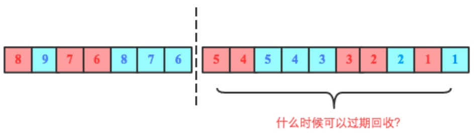

# LSM tree

## 什么是LSM-Tree
LSM-Tree全称是Log Structured Merge Tree，是一种分层，有序，面向磁盘的数据结构，其核心思想是充分了利用了，磁盘批量的顺序写要远比随机写性能高出很多

## SSTable 

>sstable（Sorted String Table）是拥有持久化，有序且不可变的键值存储结构，他的key和value都是任意的字节数组

SSTable是一种拥有持久化，有序且不可变的的键值存储结构，它的key和value都是任意的字节数组，并且了提供了按指定key查找和指定范围的key区间迭代遍历的功能。

SSTable内部包含了一系列可配置大小的Block块，典型的大小是64KB，关于这些Block块的index存储在SSTable的尾部，用于帮助快速查找特定的Block。

当一个SSTable被打开的时候，index会被加载到内存，然后根据key在内存index里面进行一个二分查找，查到该key对应的磁盘的offset之后，然后去磁盘把响应的块数据读取出来。

当然如果内存足够大的话，可以直接把SSTable直接通过MMap的技术映射到内存中，从而提供更快的查找。

# LSM-Tree结构

在LSM-Tree里，SSTable有一份在内存里面，其他的多级在磁盘上，如下图是一份完整的LSM-Tree图示：

## 写
我们总结下在在LSM-Tree里面如何写数据的？

1. 当收到一个写请求时，会先把该条数据记录在WAL Log里面，用作故障恢复。

2. 当写完WAL Log后，会把该条数据写入内存的SSTable里面（删除是墓碑标记，更新是新记录一条的数据），也称Memtable。注意为了维持有序性在内存里面可以采用红黑树或者跳跃表相关的数据结构。

3. 当Memtable超过一定的大小后，会在内存里面冻结，变成不可变的Memtable，同时为了不阻塞写操作需要新生成一个Memtable继续提供服务。

4. 把内存里面不可变的Memtable给dump到到硬盘上的SSTable层中，此步骤也称为Minor Compaction，这里需要注意在L0层的SSTable是没有进行合并的，所以这里的key range在多个SSTable中可能会出现重叠，在层数大于0层之后的SSTable，不存在重叠key。

5. 当每层的磁盘上的SSTable的体积超过一定的大小或者个数，也会周期的进行合并。此步骤也称为Major Compaction，这个阶段会真正 的清除掉被标记删除掉的数据以及多版本数据的合并，避免浪费空间，注意由于SSTable都是有序的，我们可以直接采用merge sort进行高效合并。

## 读

1，当收到一个读请求的时候，会直接先在内存里面查询，如果查询到就返回。

2，如果没有查询到就会依次下沉，知道把所有的Level层查询一遍得到最终结果。

思考查询步骤，我们会发现如果SSTable的分层越多，那么最坏的情况下要把所有的分层扫描一遍，对于这种情况肯定是需要优化的，如何优化？在 Bigtable 论文中提出了几种方式：

1，压缩

SSTable 是可以启用压缩功能的，并且这种压缩不是将整个 SSTable 一起压缩，而是根据 locality 将数据分组，每个组分别压缩，这样的好处当读取数据的时候，我们不需要解压缩整个文件而是解压缩部分 Group 就可以读取。

2，缓存

因为SSTable在写入磁盘后，除了Compaction之外，是不会变化的，所以我可以将Scan的Block进行缓存，从而提高检索的效率

3，索引，Bloom filters

正常情况下，一个读操作是需要读取所有的 SSTable 将结果合并后返回的，但是对于某些 key 而言，有些 SSTable 是根本不包含对应数据的，因此，我们可以对每一个 SSTable 添加 Bloom Filter，因为布隆过滤器在判断一个SSTable不存在某个key的时候，那么就一定不会存在，利用这个特性可以减少不必要的磁盘扫描。

4，合并

这个在前面的写入流程中已经介绍过，通过定期合并瘦身， 可以有效的清除无效数据，缩短读取路径，提高磁盘利用空间。但Compaction操作是非常消耗CPU和磁盘IO的，尤其是在业务高峰期，如果发生了Major Compaction，则会降低整个系统的吞吐量，这也是一些NoSQL数据库，比如Hbase里面常常会禁用Major Compaction，并在凌晨业务低峰期进行合并的原因

# B+Tree VS LSM-Tree

传统关系型数据采用的底层数据结构是B+树，那么同样是面向磁盘存储的数据结构LSM-Tree相比B+树有什么异同之处呢？

LSM-Tree的设计思路是，将数据拆分为几百M大小的Segments，并是顺序写入。

B+Tree则是将数据拆分为固定大小的Block或Page, 一般是4KB大小，和磁盘一个扇区的大小对应，Page是读写的最小单位。

在数据的更新和删除方面，B+Tree可以做到原地更新和删除，这种方式对数据库事务支持更加友好，因为一个key只会出现一个Page页里面，但由于LSM-Tree只能追加写，并且在L0层key的rang会重叠，所以对事务支持较弱，只能在Segment Compaction的时候进行真正地更新和删除。

因此LSM-Tree的优点是支持高吞吐的写（可认为是O（1）），这个特点在分布式系统上更为看重，当然针对读取普通的LSM-Tree结构，读取是O（N）的复杂度，在使用索引或者缓存优化后的也可以达到O（logN）的复杂度。

而B+tree的优点是支持高效的读（稳定的OlogN），但是在大规模的写请求下（复杂度O(LogN)），效率会变得比较低，因为随着insert的操作，为了维护B+树结构，节点会不断的分裂和合并。操作磁盘的随机读写概率会变大，故导致性能降低。

还有一点需要提到的是基于LSM-Tree分层存储能够做到写的高吞吐，带来的副作用是整个系统必须频繁的进行compaction，写入量越大，Compaction的过程越频繁。而compaction是一个compare & merge的过程，非常消耗CPU和存储IO，在高吞吐的写入情形下，大量的compaction操作占用大量系统资源，必然带来整个系统性能断崖式下跌，对应用系统产生巨大影响，当然我们可以禁用自动Major Compaction，在每天系统低峰期定期触发合并，来避免这个问题。

阿里为了优化这个问题，在X-DB引入了异构硬件设备FPGA来代替CPU完成compaction操作，使系统整体性能维持在高水位并避免抖动，是存储引擎得以服务业务苛刻要求的关键。

# sequenceId

## 为什么需要sequenceId？

HBase数据在写入的时候首先追加写入HLog，再写入Memstore，也就是说一份数据会以两种不同的形式存在于两个地方。那两个地方的同一份数据需不需要一种机制将两者关联起来？有的朋友要问为什么需要关联这两者，那笔者这里提出三个相关问题：

1. Memstore中的数据flush到HDFS文件中后HLog对应的数据是不是就可以被删除了？不然HLog会无限增长！那问题来了，Memstore中被flush到HDFS的数据，如何映射到HLog中的相关日志数据？

2. HBase中单个HLog都有固定大小，日志文件最大个数也是固定设置的，默认最大HLog文件数量为8。如果日志数量超过这个数量，就必须删除最老的HLog日志。那问题来了，如何知道待删除HLog日志对应的所有数据都已经落盘了？（如果知道哪些数据没有落盘，就可以强制对其执行flush，之后就可以将HLog删除）

3. RegionServer宕机之后Memstore中数据必然会丢失，大家都知道可以通过HLog进行恢复。那问题来了，HLog中哪些数据需要恢复？哪些不需要恢复？

这三个问题从本质上来讲是一个问题，都需要一种介质来表示Memstore中数据Flush的那个点对应HLog哪个位置，这个介质就是本文要介绍的重点－sequenceId

## HLog日志核心结构

要理解sequenceId，需要简单了解HBase中HLog文件的基本结构，如下图所示，关注点主要有两点：

1. 每个RegionServer拥有一个或多个HLog（默认只有1个，1.x版本可以开启MultiWAL功能，允许多个HLog）。每个HLog是多个Region共享的，如图所示，Region A、Region B和Region C共享一个HLog文件。

2. HLog中日志单元WALEntry表示一次行级更新的最小追加单元（图中红色/黄色小方框），它由两部分组成：HLogKey和WALEdit，HLogKey中包含多个属性信息，包含table name、region name、sequenceid等；WALEdit用来表示一个事务中的更新集合，一次行级事务可以原子操作同一行中的多个列。上图中WALEdit包含多个KeyValue。

## 什么是sequenceid？

sequenceid是region级别一次行级事务的自增序号。这个定义是我琢磨出来的，需要关注的地方有三个：

1. sequenceid是自增序号。很好理解，就是随着时间推移不断自增，不会减小。

2. sequenceid是一次行级事务的自增序号。行级事务是什么？简单点说，就是更新一行中的多个列族、多个列，行级事务能够保证这次更新的原子性、一致性、持久性以及设置的隔离性，HBase会为一次行级事务分配一个自增序号。

3. sequenceid是region级别的自增序号。每个region都维护属于自己的sequenceid，不同region的sequenceid相互独立。

在这样的定义条件下，HLog就会如下图所示：

HLog中有两个Region的日志记录，方框中的数字表示sequenceid，随着时间的推移，每个region的sequenceid都独立自增。

## 问题一：HLog在什么时候可以过期回收？

下图中虚线右侧部分为超过单个HLog大小阈值后切分形成的一个HLog文件，问题是这个文件什么时候可以被系统回收删除。理论上来说只需要这个文件上所有Region对应的最大sequenceid已经落盘就可以删除，比如下图中如果RegionA对应的最大sequenceid(5)已经落盘，同时RegionB对应的最大sequenceid(5)也落盘，那该HLog就可以被删除。那怎么实现的呢？

RegionServer会为每个Region维护了一个变量oldestUnflushedSequenceId（实际上是为每个Store，为了方便讲解，此处暂且认为是Region，不影响原理），表示这个Region最早的还未落盘的seqid ，即这个seqid之前的所有数据都已经落盘。接下来看看这个值在flush的时候是怎么维护的，以及如何用这个值实现HLog的过期回收判断。

下图是flush过程中oldestUnflushedSequenceId变量变化的示意图，初始时为null，假设在某一时刻阶段二RegionA(红色方框)要执行flush，中间HLog中sequenceId为1~4对应的数据将会落盘，在执行flush之前，HBase会append一个空的Entry到HLog，仅为获取下一个sequenceId(5)，并将这个sequenceId赋给OldestUnflushedSequenceId-RegionA。如图中第三阶段OldestUnflushedSequenceId-RegionA指向sequenceId为5的Entry。

可见，每次flush之后这个变量就会往前移动一段距离。这个变量至关重要，是解决文初提到的三个问题的关键。基于上述对这个变量的理解，来看看下面两种场景下右侧HLog是否可以删除：

很显然，场景一中右侧HLog还有未落盘的数据（sequenceid=5还未落盘），因此不能删除；而场景二中右侧HLog的所有数据都已经落盘，所以这个HLog理论上就已经可以被删除回收。

## 问题二：HLog数量超过阈值(maxlogs)之后删除最早HLog，应该强制刷新哪些Region？

假设当前系统设置了HLog的最大数量为32，即hbase.regionserver.maxlogs=32，上图中最左侧HLog是第33个，此时系统会获取到最老的日志（最右侧HLog），并检查所有的Entry对应的数据是否都已经落盘，如图所示RegionC还有部分数据没有落地，为了安全删除这个HLog就必须强制对本HLog中多个Region执行flush操作，将所有数据落盘。

## 问题三：RegionServer宕机恢复replay日志时哪些WALEntry需要被回放，哪些会被skip？

理论上来说只需要回放Memstore中没有落地的数据对应的WALEntry，已经落地数据对应的WALEntry可以skip。可问题是RegionServer已经宕机了，<region, oldestUnflushedSequenceId> 对应信息肯定没有了，如何是好？想办法持久化呗，上文分析oldestUnflushedSequenceId变量是flush时产生的一个变量，这个变量完全可以以flush的时候以元数据的形式写到HFile中（代码见下图）：

这样Region在宕机迁移重新打开之后加载HFile元数据就可以恢复出这个核心变量oldestUnflushedSequenceId（本次flush所生成的所有HFlie中都存储同一个sequenceId），这个sequenceId在恢复出来之后就可以用来在回放WALEntry的时候过滤哪些Entry需要被回放，哪些会被skip。

这里提一个问题：有没有可能一次flush所生成的所有HFile中存储的sequenceId出现不一致，比如：region中所有store（store1、store2）都执行flush，其中store1执行flush成功，此时oldestUnflushedSequenceId变量成功追加到对应的HFile中；但在store2执行flush之前RegionServer发生宕机异常，store2对应的oldestUnflushedSequenceId变量还是上个文件对应的sequenceId，这种情况下回放数据会不会有影响？如果有，为什么？如果没有，是什么机制保证的？

**到目前为止，上面所有分析都基于一个事实：hbase中flush操作是region级别操作，即每次执行flush都需要整个region中的所有store全都执行flush。接下来作为延伸阅读内容，对Per-CF Flush比较感兴趣的可以继续阅读，Per-CF Flush允许系统对某个或某些列组单独执行flush。实现原理与上文所分析内容基本相似。不同的是上文中oldestUnflushedSequenceId是与region一一对应的，Per-CF Flush中这个参数需要细化到store，与store一一对应。**

# 延伸阅读：Per-CF Flush
region级别flush确实存在不少问题，在多个列族的情况下其中一个store大小超过了阈值（128M），不论其他store多大多小都会强制落盘，有些很小的列族（几兆）落盘后形成很多特别小的文件，对hbase的读并不是一件好事。

per-cf flush允许单个store执行flush，该feature在1.0.0以上版本已经存在，在1.2.0版本设置为默认策略。实现这个功能有两个必要的工作，其一是提出一种新的flush策略能够在多个列族中选择一个或者多个单独进行进行flush，目前新策略称为FlushLargerStoresPolicy，即选择当前最大的一个store进行flush。其二是必须将oldestUnflushedSequenceId的粒度从region细化到store，即从map<region, oldestUnflushedSequenceId>改为map<region, map<store, oldestUnflushedSequenceId>>，上文所述三个问题的判断逻辑也需要修改为store级别判断逻辑。这里使用store级别判断逻辑简单对问题一和问题三进行复盘。

## Per-CF Flush策略下，HLog在什么时候可以过期回收？
region级别的判断逻辑主要依赖于map<region, oldestUnflushedSequenceId>，详见上文。store级别的数据结构改为了map<region, map<store, oldestUnflushedSequenceId>>，其实很容易经过简单的转化又变回region级别，map<store, oldestUnflushedSequenceId>找到最小的oldestUnflushedSequenceId称为minSeqNum，这样region级别的数据结构就变出来了 – map<region, minSeqNum>，其他逻辑都不用变。

## Per-CF Flush策略下，RegionServer宕机恢复replay日志时哪些数据需要被回放，哪些会被skip？
这个问题稍微复杂一点，第一个关注的问题是回放粒度的问题。需要回过头来看看HLog中Entry的组成，如图可以知道一个Entry由WALKey和WAKEdit两部分构成，WALKey包含一些基本信息，本文重点关注sequenceId这个变量；WALEdit包含插入\更新的KeyValue集合，这里需要重点注意，这些KeyValue可能包含一行中多个列族（列），因此可以说WALEdit会包含多个store更新的KeyValue。

在All-CF Flush策略下，我们以HLog-Entry为粒度进行数据回放没有任何问题，但是在Per-CF Flush策略下就不再行得通。因为一个HLog-Entry中多个CF的KeyValue是混在一起的，可能部分KV已经落盘，其他部分还没有。因此需要将回放粒度减小到KeyValue级别，一个一个KeyValue分别进行检查回放。

回放粒度问题摸清了，再来关注哪些KeyValue需要被回放，哪些会被skip。上文说过，每次flush的时候对应的oldestUnflushedSequenceId会被持久化到HFile的元数据中。在All-CF Flush策略下，一次flush操作中整个region所有store所持久化的oldestUnflushedSequenceId都相同，因此回放的时候HLog-Entry的sequenceId只需要与这一个oldestUnflushedSequenceId比较就可以，大的话就需要回放，小的话就skip。但在Per-CF的场景下又不再行得通，一个region中不同store都有自己独立的oldestUnflushedSequenceId，因此回放的时候需要根据KeyValue找到对应store，在与该store中的oldestUnflushedSequenceId比较，大的话需要回放，小的话skip。

总结起来就是：skip hlog cells per store when replaying，注意这里蕴含两个点： hlog cells 以及 per store。

