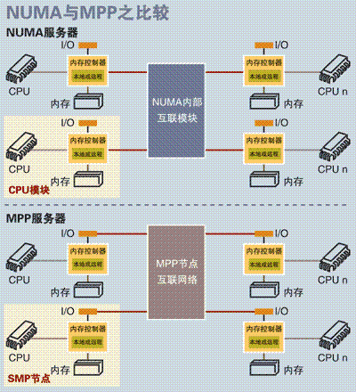

#服务器三大体系
从系统架构来看，目前的商用服务器大体可以分为三类

- 对称多处理器结构(SMP：Symmetric Multi-Processor)
- 非一致存储访问结构(NUMA：Non-Uniform Memory Access)
- 以及海量并行处理结构(MPP：Massive Parallel Processing)

##SMP
定义：所谓对称多处理器结构，是指服务器中多个CPU对称工作，无主次或从属关系。各CPU共享相同的物理内存，每个 CPU访问内存中的任何地址所需时间是相同的，因此SMP也被称为一致存储器访问结构(UMA：Uniform Memory Access)。

SMP服务器CPU利用率最好的情况是2至4个CPU。

##NUMA

定义：NUMA服务器的基本特征是具有多个CPU模块，每个CPU模块由多个CPU(如4个)组成，并且具有独立的本地内存、I/O槽口等。由于其节点之间可以通过互联模块(如称为Crossbar Switch)进行连接和信息交互，因此每个CPU可以访问整个系统的内存(这是NUMA系统与MPP系统的重要差别)。显然，访问本地内存的速度将远远高于访问远地内存(系统内其它节点的内存)的速度，这也是非一致存储访问NUMA的由来。

NUMA服务器的例子包括HP的Superdome、SUN15K、IBMp690等。

NUMA技术同样有一定缺陷，由于访问远地内存的延时远远超过本地内存，因此当CPU数量增加时，系统性能无法线性增加。

##MPP

其基本特征是由多个SMP服务器(每个SMP服务器称节点)通过节点互联网络连接而成，每个节点只访问自己的本地资源(内存、存储等)，是一种完全无共享(Share Nothing)结构，因而扩展能力最好，理论上其扩展无限制，目前的技术可实现512个节点互联，数千个CPU。

##MPP架构的产品

阿里云的ADS、
Presto、Impala、
elasticsearch、
Teradata

##MPP和hadoop

|比较项目|MPP|Hadoop|
|---|---|---|
|平台开放|封闭和专有。对于某些技术,甚至不能为非客户下载文档|通过互联网免费提供供应商和社区资源的完全开源|
|可扩展性|平均数十个节点，最大100-200|平均100个节点，可扩展至几千个节点个节点|
|可处理数据|平均10TB,最大1PB|平均100TB, 多值1oPB|
|延迟|10-20毫秒|10-20秒|
|平均查询时间|5-7 秒|10-15分钟|
|最大查询时间|1-2小时|1-2周|
|查询优化|拥有复杂的企业级优化器|没有优化器或优化器功能非常有限，有时甚至优化不是基于成本的|
|查询调试和分析|便于查看的查询执行计划、OOM问题和Java堆转储分析，GC在群集组件上暂停|每个任务的单独日志给你很多的时间|
|技术价格|每个节点数十万美元|每个节点免费或高达数千美元|
|易用性|简单友好的SQL界面和简单可编译|SQL不完全符合ANSI标准，用户应该关心执行逻辑，底层数据布局。 函数通常需要用Java编写，编译并放在集群上的数据库内功的数据库内置函数|
|目标用户| 业务分析师| Java开发人员和经验丰富的DBA|
|单作业冗余|低，当MPP节点发生故障时作业失败 |高，作业只有当节点管理作业执行失败时才会失败|
|最小数据集 |      任意 |                                 GB
|最大并发性|       十到数百个查询 |                多达10-20个job|
|技术可扩展性|  仅使用供应商提供的工具        | 混搭
|DBA技能等级要求  | 普通DBA                 |需要懂Java编程的高级RDBMS的DBA|
|解决方案实施复杂性 |  一般                 |     复杂|

