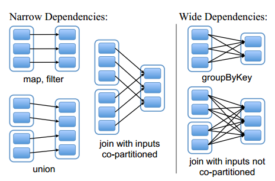
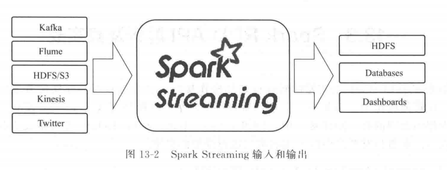
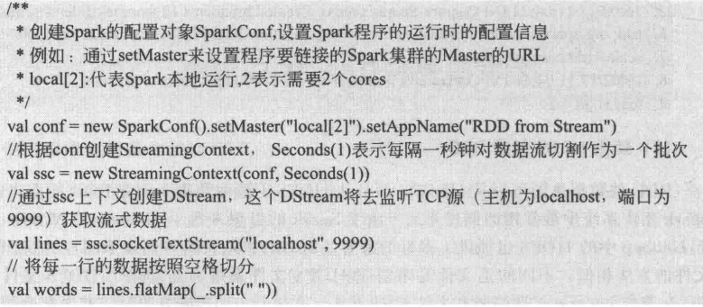

### 1.提交任务命令格式

```
bin/spark-submit --master yarn-cluster --jars /Users/zhuyun/.m2/repository/com/aliyun/odps/odps-spark-datasource_2.11/3.3.2-public/odps-spark-datasource_2.11-3.3.2-public.jar --class com.zhuyun.maxcompute.sparkReader ~/Desktop/Project/spark/target/spark-1.0-SNAPSHOT.jar 
```


### 2.RDD的定义

RDD（Resilient Distributed Dataset）是弹性分布式数据集，它代表一个不可变、可分区、
里面的元素可并行计算的集合。

RDD具有数据流模型的特点：

✨自动容错

✨位置感知性调度

✨可伸缩性
### 3.RDD的两种操作类型

转换（Transformation）：将一个已有的RDD生成另外一个RDD。
Transformation具有lazy特性(延迟加载)。Transformation算子的代码不会真正被执行。只有
当我们的程序里面遇到一个action算子的时候，代码才会真正的被执行。

RDD依赖：在对RDD进行转换操作过程中，每个操作都会在已有的RDD基础上产生新的RDD。由于RDD的lazy特性，新的RDD会依赖于原有的RDD。这样RDD之间就会形成相应的依赖关系。


RDD的依赖关系两大类：

✨窄依赖：是指每个父RDD的一个partition最多被子RDD的一个partition所使用，如map，
filter，union等都会产生窄依赖。

✨宽依赖：是指一个父RDD的partition会被多个子RDD的partition使用，如reducebykey，
groupbykey，sortbykey


```
Spark Lineage(血统)

利用内存加快数据加载，在众多的其它的In-Memory类数据库或Cache类系统中也有实现，Spark的
主要区别在于它处理分布式运算环境下的数据容错性（节点实效/数据丢失）问题时采用的方案。为了
保证RDD中数据的鲁棒性，RDD数据集通过所谓的血统关系(Lineage)记住了它是如何从其它RDD中演
变过来的。相比其它系统的细颗粒度的内存数据更新级别的备份或者LOG机制，RDD的Lineage记录的
是粗颗粒度的特定数据转换（Transformation）操作（filter, map, join etc.)行为。当这
个RDD的部分分区数据丢失时，它可以通过Lineage获取足够的信息来重新运算和恢复丢失的数据分
区。这种粗颗粒的数据模型，限制了Spark的运用场合，但同时相比细颗粒度的数据模型，也带来了性
能的提升。

RDD在Lineage依赖方面分为两种Narrow Dependencies与Wide Dependencies用来解决数据容
错时的高效性。

Narrow Dependencies是指父RDD的每一个分区最多被一个子RDD的分区所用，表现为一个父RDD的
分区对应于一个子RDD的分区或多个父RDD的分区对应于一个子RDD的分区，也就是说一个父RDD的一
个分区不可能对应一个子RDD的多个分区。

Wide Dependencies是指子RDD的分区依赖于父RDD的多个分区或所有分区，也就是说存在一个父
RDD的一个分区对应一个子RDD的多个分区。对与Wide Dependencies，这种计算的输入和输出在不
同的节点上，lineage方法对与输入节点完好，而输出节点宕机时，通过重新计算，这种情况下，这种
方法容错是有效的，否则无效，因为无法重试，需要向上其祖先追溯看是否可以重试（这就是
lineage，血统的意思），Narrow Dependencies对于数据的重算开销要远小于Wide 
Dependencies的数据重算开销。
```



```
容错

在RDD计算，通过checkpoint进行容错，做checkpoint有两种方式，一个是checkpoint data，
一个是logging the updates。用户可以控制采用哪种方式来实现容错，默认是logging the 
updates方式，通过记录跟踪所有生成RDD的转换（transformations）也就是记录每个RDD的
lineage（血统）来重新计算生成丢失的分区数据。

```


执行（action）：触发代码的运行，一段spark代码里面至少需要有一个action操作。

### 4.RDD的属性

（1）一组分片（Partition），即数据集的基本组成单位。对于RDD来说，每个分片都会被一个计算任务处理，并决定并行计算的粒度。用户可以在创建RDD时指定RDD的分片个数，如果没有指定，那么就会采用默认值。默认值就是程序所分配到的CPU Core的数目。

（2）一个计算每个分区的函数。Spark中RDD的计算是以分片为单位的，每个RDD都会实现compute函数以达到这个目的。compute函数会对迭代器进行复合，不需要保存每次计算的结果。

（3）RDD之间的依赖关系。RDD的每次转换都会生成一个新的RDD，所以RDD之间就会形成类似于流水线一样的前后依赖关系。在部分分区数据丢失时，Spark可以通过这个依赖关系重新计算丢失的分区数据，而不是对RDD的所有分区进行重新计算。


（4）一个Partitioner，即RDD的分片函数。当前Spark中实现了两种类型的分片函数，一个是基于哈希的HashPartitioner，另外一个是基于范围的RangePartitioner。只有对于于key-value的
RDD，才会有Partitioner，非key-value的RDD的Parititioner的值是None。Partitioner函数不但决定了RDD本身的分片数量，也决定了parent RDD Shuffle输出时的分片数量。

（5）一个列表，存储存取每个Partition的优先位置（preferred location）。对于一个HDFS文件来说，这个列表保存的就是每个Partition所在的块的位置。按照“移动数据不如移动计算”的理念，Spark在进行任务调度的时候，会尽可能地将计算任务分配到其所要处理数据块的存储位置。


### 5.RDD的创建方式
#### 5.1 使用程序中的集合创建RDD
```
scala> val seq = List(("American Person", List("Tom", "Jim")), ("China Person", List("LiLei", "HanMeiMei")), ("Color Type", List("Red", "Blue")))

scala> val rdd1 = sc.parallelize(seq)

scala> rdd1.partitions.size  // 2

scala> val rdd2 = sc.makeRDD(seq)

scala> rdd2.partitions.size  // 3

第一种makerdd与parallerize两者完全一致，传递的都是集合的形式；其实第一种makerdd实现是依赖了parallelize函数

第二种makerdd还提供了计算位置

```
#### 5.2 通过读取本地文件系统创建

文件（外部存储系统的数据集创建）来源有：

✨本地的文件系统

✨所有Hadoop支持的数据集，比如HDFS、Cassandra、HBase等

```
scala> val file = sc.textFile("/spark/hello.txt")
```

#### 5.3 使用HDFS创建RDD
#### 5.4 使用数据流创建RDD


#### 5.5 从其他数据库（HBASE，Hive，Mysql）创建RDD

### 6. DataFrame
DataFrame是一个分布式集合，其中数据被组织为命名的列。它概念上等价于关系数据库中的表，但底层做了更多的优化。DataFrame可以从很多数据源构建，比如：已经存在的RDD、结构化文件、外部数据库、Hive表。

**DataFrame是一个一个Row类型的RDD**

#### 6.1 通过读取json格式的文件创建DataFrame
缺点：json格式文件嵌套不能过复杂

```
scala> val df = sqlContext.read.json("sparksql/json") 
或者
scala> val df1 = sqlContext.read.format("json").load("sparksql/json")

```
#### 6.2 通过json格式的RDD创建DataFrame

```
scala> val nameRDD = sc.makeRDD(Array(
  		"{\"name\":\"zhangsan\",\"age\":18}",
  		"{\"name\":\"lisi\",\"age\":19}",
  		"{\"name\":\"wangwu\",\"age\":20}"
		))

scala> val scoreRDD = sc.makeRDD(Array(
        "{\"name\":\"zhangsan\",\"score\":100}",
        "{\"name\":\"lisi\",\"score\":200}",
        "{\"name\":\"wangwu\",\"score\":300}"
        ))
scala> val nameDF = sqlContext.read.json(nameRDD)
scala> val scoreDF = sqlContext.read.json(scoreRDD)

```

#### 6.3 非json格式的RDD创建DataFrame（重要）
##### 6.3.1 通过反射的方式将非json格式的RDD转换成DataFrame
***1.自定义类要可序列化***

***2.自定义类的访问级别是Public***

***3.RDD转成DataFrame后会根据映射将字段按Assci码排序***

***4.将DataFrame转换成RDD时获取字段两种方式,一种是df.getInt(0)下标获取（不推荐使用），另一种是df.getAs(“列名”)获取（推荐使用）***

***5.关于序列化的问题***


```
1.反序列化时serializable 版本号不一致时会导致不能反序列化。

2.子类中实现了serializable接口，父类中没有实现，父类中的变量不能被序列化,序列化后父类中
的变量会得到null。
注意：父类实现serializable接口,子类没有实现serializable接口时，子类可以正常序列化

3.被关键字transient修饰的变量不能被序列化。

4.静态变量不能被序列化，属于类，不属于方法和对象，所以不能被序列化。

5.一个文件多次writeObject时，如果有相同的对象已经写入文件，那么下次再写入时，
只保存第二次写入的引用，读取时，都是第一次保存的对象。


scala> case class Person(id:String,name:String,age:int)


scala> val lineRDD = sc.textFile("./sparksql/person.txt")
/**
 * 将RDD隐式转换成DataFrame
 */
scala> import sqlContext.implicits._

scala> val personRDD = lineRDD.map { x => {
  		val person = Person(x.split(",")(0),x.split(",")(1),Integer.valueOf(x.split(",")(2)))
  			person
		} }
scala> val df = personRDD.toDF();

/**
 * 将DataFrame转换成PersonRDD
 */
scala> val rdd = df.rdd
scala> val result = rdd.map { x => {
Person(x.getAs("id"),x.getAs("name"),x.getAs("age"))
} }


```
##### 6.3.2 动态创建Schema将非json格式的RDD转换成DataFrame（建议使用）


```
scala> val lineRDD = sc.textFile("./sparksql/person.txt")
scala> val rowRDD = lineRDD.map { x => {
  val split = x.split(",")
  RowFactory.create(split(0),split(1),Integer.valueOf(split(2)))
} }
 
scala> val schema = StructType(List(
  StructField("id",StringType,true),
  StructField("name",StringType,true),
  StructField("age",IntegerType,true)
))
 
scala> val df = sqlContext.createDataFrame(rowRDD, schema)
```

##### 6.3.3 读取parquet文件创建DataFrame

```
/**
  * 将DF保存为parquet文件
  */
df.write.mode(SaveMode.Overwrite).format("parquet").save("./sparksql/parquet")
 df.write.mode(SaveMode.Overwrite).parquet("./sparksql/parquet")
 /**
  * 读取parquet文件
  */
 var result = sqlContext.read.parquet("./sparksql/parquet")
 result = sqlContext.read.format("parquet").load("./sparksql/parquet")
 result.show()
 sc.stop()

```
##### 6.3.4 读取JDBC中的数据创建DataFrame(MySql为例)

```
/**
 * 第一种方式读取Mysql数据库表创建DF
 */
val options = new HashMap[String,String]();
options.put("url", "jdbc:mysql://192.168.179.4:3306/spark")
options.put("driver","com.mysql.jdbc.Driver")
options.put("user","root")
options.put("password", "123456")
options.put("dbtable","person")
val person = sqlContext.read.format("jdbc").options(options).load()
person.show()
person.registerTempTable("person")
/**
 * 第二种方式读取Mysql数据库表创建DF
 */
val reader = sqlContext.read.format("jdbc")
reader.option("url", "jdbc:mysql://192.168.179.4:3306/spark")
reader.option("driver","com.mysql.jdbc.Driver")
reader.option("user","root")
reader.option("password","123456")
reader.option("dbtable", "score")
val score = reader.load()
score.show()
score.registerTempTable("score")
val result = sqlContext.sql("select person.id,person.name,score.score from person,score where person.name = score.name")
result.show()
/**
 * 将数据写入到Mysql表中
 */
val properties = new Properties()
properties.setProperty("user", "root")
properties.setProperty("password", "123456")
result.write.mode(SaveMode.Append).jdbc("jdbc:mysql://192.168.179.4:3306/spark", "result", properties)
```

### 7. DataSet
Dataset是分布式数据集合。Dataset是Spark1.6.0中添加的一个新接口，既提供了RDD的优点(强类型，支持lambda表达式)，又提供了Spark SQL优化执行引擎的优点。Dataset API仅可用于Scala和Java，Python不支持Dataset API。
### 8. Dataset和DataFrame
DataFrame可以从各种来源构建，如结构化数据文件，Hive中的表，外部数据库或者现有的RDD。DataFrame API适用于Scala，Java，Python和R。在Scala和Java中，DataFrame is represented by a Dataset of Rows。在Scala API中，DataFrame is simply a type alias of Datasets[Row]。在Java API中，DataFrame被表示成Dataset\<Row\>。

### 9.Scala中集合数组
[Scala在常用的集合的类别有数组，List，Set，Map，元组。](https://www.cnblogs.com/LHWorldBlog/p/8396789.html)
#### 9.1 元组

***元组的定义***

与列表一样，与列表不同的是元组可以包含不同类型的元素。元组的值是通过将单个的值包含在圆括号中构成的。

***创建元组***

```
val  tuple = new Tuple（1） 可以使用new

val tuple2  = Tuple（1,2） 可以不使用new，也可以直接写成val tuple3 =（1,2,3）
 
取值用”._XX” 可以获取元组中的值

注意：tuple最多支持22个参数

//创建，最多支持22个
val tuple = new Tuple1(1)
val tuple2 = Tuple2("zhangsan",2)
val tuple3 = Tuple3(1,2,3)
val tuple4 = (1,2,3,4)
val tuple18 = Tuple18(1,2,3,4,5,6,7,8,9,10,11,12,13,14,15,16,17,18)
val tuple22 = new Tuple22(1,2,3,4,5,6,7,8,9,10,11,12,13,14,15,16,17,18,19,20,21,22)
 
//使用
println(tuple2._1 + "\t"+tuple2._2)
val t = Tuple2((1,2),("zhangsan","lisi"))
println(t._1._2)


```

***元祖遍历***

tuple.productIterator得到迭代器，进而遍历

```
//遍历
 val tupleIterator = tuple22.productIterator
 while(tupleIterator.hasNext){
   println(tupleIterator.next())
 }

```

***swap,toString方法***

```
注意：swap元素翻转，只针对二元组
    /**
     * 方法
     */
    //翻转，只针对二元组
    println(tuple2.swap)
     
    //toString
    println(tuple3.toString())
 备注：一般针对集合的遍历基本都是foreach ,for方法！！！！！

```

#### 9.2 map集合

***创建map***

```
Map（1 –>”bjsxt’）

Map((1,”bjsxt”))

注意：创建map时，相同的key被后面的相同的key顶替掉，只保留一个

```

***获取map的值***


```
map.get(“1”).get

map.get(100).getOrElse(“no value”)：如果map中没有对应项，赋值为getOrElse传的值。

//获取值
  println(map.get("1").get)
  val result = map.get(8).getOrElse("no value")
  println(result)
```

***遍历map***

 for,foreach
 
```

//map遍历
   for(x <- map){
     println("====key:"+x._1+",value:"+x._2)
   }
   map.foreach(f => {
     println("key:"+ f._1+" ,value:"+f._2)
   })
   
```

***遍历key***

map.keys


```
//遍历key
val keyIterable = map.keys
keyIterable.foreach { key => {
  println("key:"+key+", value:"+map.get(key).get)
} }
println("---------")

```
***遍历value***

map.values

```
//遍历value
   val valueIterable = map.values
   valueIterable.foreach { value => {
     println("value: "+ value)
   } }
```

***合并map***

```

++  例：map1.++(map2)  --map1中加入map2

++:  例：map1.++:(map2) –map2中加入map1

注意：合并map会将map中的相同key的value替换


//合并map
   val map1 = Map(
     (1,"a"),   
     (2,"b"),   
     (3,"c")   
   )
   val map2 = Map(
     (1,"aa"),
     (2,"bb"),
     (2,90),
     (4,22),
     (4,"dd")
   )
   map1.++:(map2).foreach(println)

```

***map中的方法举例***


```
filter:过滤，留下符合条件的记录

count:统计符合条件的记录数

contains：map中是否包含某个key

exist：符合条件的记录存在不存在

/**
    * map方法
    */
   //count
   val countResult  = map.count(p => {
     p._2.equals("shsxt")
   })
   println(countResult)
    
   //filter
   map.filter(_._2.equals("shsxt")).foreach(println)
    
   //contains
   println(map.contains(2))
   
   //exist
   println(map.exists(f =>{
     f._2.equals("xasxt")
      
   }))

```

