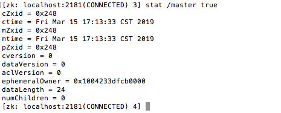

### 1.zookeeper能做什么？

```
它可以在分布式系统中协作多个任务，一个协作任务是指一个包含多个进程的任务

```
### 2.真实系统中的三个问题

```
1.消息延迟
2.处理器性能
3.时钟偏移
```
### 3.主从模式的三个问题

```
1.主节点崩溃
2.从节点崩溃
3.通信故障
```
### 4.主从架构的需求

```
1.主节点选举
2.崩溃检测：主节点必须具有检测从节点崩溃或者失去连接的能力
3.组成员关系管理：主节点必须有知道哪一个从节点可以执行任务的能力
4.元数据管理：主节点和从节点必须具有通过某种可靠的方式来保存分配状态和执行状态的能力
```
### 5.CAP理论

```
Partition tolerance：分区容错
Consistency：一致性
Availability：可用性
一般来说，分区容错无法避免，因此可以认为 CAP 的 P 总是成立。
CAP 定理告诉我们，剩下的 C 和 A 无法同时做到。
```

### 6.znode类型

```
1.持久的
2.临时的
3.持久有序的
4.临时有序的
```

### 7.监视与通知
7.1 同一个znode的多次读取

7.2 使用通知机制来获悉znode的变化

7.3 使用版本来阻止并行操作的不一致性


### 8.zookeeper配置项

```
server.1=127.0.0.1:2222:2223
1.server.n项指定了编号为n的zookeeper服务器使用的地址和端口号
2.server.n项通过冒号分割为三部分，第一部分为服务器n的IP地址，第二部分和第三部分为TCP端口号，分别用于仲裁通信和群首选举。
3.zookeeper服务器启动通过读取data目录下一个名为myid的文件来获取服务器ID信息
```

### 9.一个主从模式例子


#### 主节点角色崩溃


1.master 创建主节点/master

```
创建主节点的znode，以便获得管理权。使用-e标志来表示创建的znode为临时性的
主机信息master1.example.com:2223
create -e /master "master1.example.com:2223"
```

2.master 获取/master znode的元数据和数据


3.master_bk 创建/master znode主节点


4.master_bk 设置监视点

```
stat /master true
```


5.master崩溃，主节点崩溃，master_bk监测到变化


6.master_bk创建新的主节点

```
创建主节点的znode，以便获得管理权。使用-e标志来表示创建的znode为临时性的
主机信息master2.example.com:2223
create -e /master "master2.example.com:2223"

```


#### 从节点,任务和分配


1.主进程在分配任务前创建三个父znode，/workers，/tasks和/assign


2.主节点监视/workers和tasks的子节点的变化情况


3.从节点通知主节点，告知从节点可以执行任务

```
create -e /workers/worker1.example.com "worker1.example.com:2224"
```


4.主节点监控获取workers消息


5.从节点创建一个父znode /assign/worker1.example.com来接收任务分配,并监视这个节点的变化

```
create /assign/worker1.example.com ""
ls /assign/worker1.example.com true
```


6.客户端向系统中添加任务


```
create -s /tasks/task- "cmd"
```

7.客户端监视状态znode的创建事件

```
	客户端按照任务的添加顺序来添加znode，其本质上是一个队列。客户端必须
等待任务执行完毕。执行任务的从节点将任务执行完成后，会创建一个znode来表
示任务状态。客户端必须通过查看任务状态的znode是否创建来确定任务是否执行
完毕，因此客户端需要监视状态znode的创建事件。
ls /tasks/task-0000000000 true
```
8.一旦创建任务的znode，主节点观察到以下事件


9.主节点检查任务，获取可用的从节点列表，分配任务给从节点

```
ls /tasks
ls /workers
create /assign/worker1.example.com/task-0000000001 ""
```


10.从节点接收到新的任务分配的通知


11.从节点检查新任务，确认任务是否分配给自己


12.从节点任务执行完毕后，会在/tasks/task-0000000000节点下创建状态znode节点

```
create /tasks/task-0000000000/status “done”
```

13.客户端接收到通知，并执行结果


