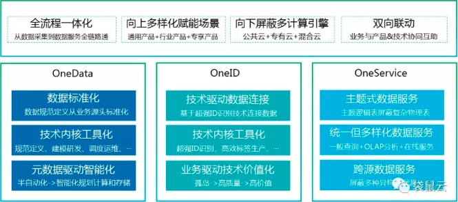
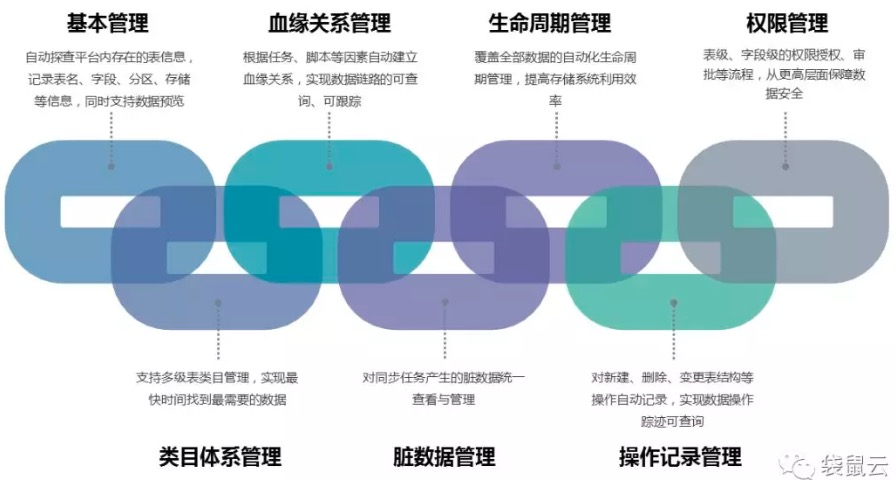
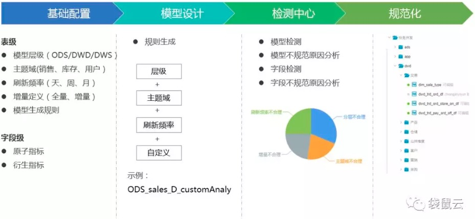
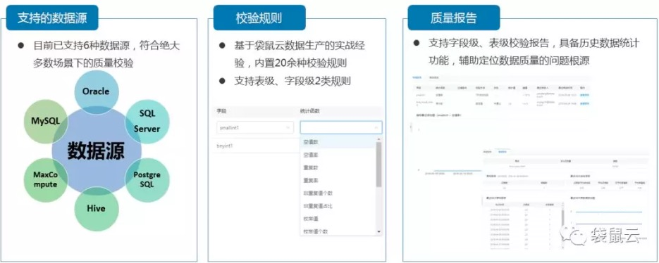

# 数据中台设计
>数据中台是涵盖了数据资产、数据治理、数据模型、垂直数据中心、全域数据中心、萃取数据中心、数据服务等多个层次的体系化建设方法

## 数据中台建设方法论

## 数据中台建设内容

### 1.全域数据采集与引入
以需求为驱动，以数据多样性的全域思想为指导，采集与引入全业务（电商、零售、生产等）、多终端（PC、H5、APP等）、多形态（自身业务系统、三方购买、互联网采集抓取）的数据。

### 2.标准规范数据架构与研发
统一基础层、公共中间层、百花齐放应用层的数据分层架构模式，通过数据指标结构化规范化的方式实现指标口径统一。

### 3.连接与深度萃取数据价值
形成以业务核心对象为中心的连接和标签体系，深度萃取数据价值。

### 4.统一数据资产管理
构建元数据中心，通过资产分析、应用、优化、运营四方面对看清数据资产、降低数据管理成本、追踪数据价值。

### 5.统一主题式服务
通过构建服务元数据中心和数据服务查询引擎，面向业务统一数据出口与数据查询逻辑，屏蔽多数据源与多物理表。

## 数据中台设计方法

1. 数据模型层次设计

数据中台将数据分为操作数据层（ODS）、公共维度模型层（CDM）(其中公共维度模型层包括明细数据层（DWD）和汇总数据层（DWS）)、应用数据层（ADS）。

2. 数据规范定义设计

规范定义是指以维度建模作为理论基础，构建总线矩阵，划分和定义数据域、业务过程、维度、度量/原子指标、修饰类型、修饰词、时间周期、衍生指标等。一般指标组成体系可以划分为：原子指标、衍生指标、修饰类型、修饰词、时间周期。
表命名规范：

	ODS：ods_[业务库名]_{业务库原始表名}[_delta]

	DWD：dwd_{主题缩写}_{业务过程缩写}[_自定义标签缩写]_{单分区增量全量标识}

	DWS：dws_{数据域缩写}[_自定义标签缩写]_{刷新周期标识}

	ADS：ads_ [_业务应用缩写][_维度][_自定义标签缩写]_{刷新周期标识}

	DIM：dim_{维度定义}

3. 数据模型设计

维度建模是专门用于分析型数据库、数据仓库、数据集市建模的方法，维度建模以分析决策的需求出发构建模型，构建的数据模型为分析需求服务，因此它重点解决用户如何更快速完成分析需求，同时还有较好的大规模复杂查询的响应性能。

维度建模常见的由星型模型、雪花模型和星座模型三种，数据中台设计一般采用星型模型。

**星型**：一种非正规化的结构，多维数据集的每一个维度都直接与事实表相连接，不存在渐变维度，所以数据有一定的冗余。

**雪花型**：雪花模型是对星型模型的扩展。它对星型模型的维表进一步层次化，原有的各维表可能被扩展为小的事实表，形成一些局部的 "层次 " 区域，这些被分解的表都连接到主维度表而不是事实表，通过最大限度地减少数据存储量以及联合较小的维表来改善查询性能。雪花型结构去除了数据冗余。

**事实星座**：又称星系模式，复杂的应用可能需要多个事实表共享维表。这种模式可以看作星形模式集。

# 数据资产管理

## 数据地图管理

## 数据模型管理

数据模型管理，主要是为解决架构设计和数据开发的不一致性，是为了约束平台使用者的表名、字段名的规范性，架构师从工具层合理的进行模型分层和统一开发规范，包括2部分，一个是规则配置，另一个是对表名、字段名的定期校验。

>规则配置：可以配置表名必须由哪几个元素组成，比如表名=数据仓库所属层级+表所属主题+数据更新周期+增量/全量，按照这个规则，表名就会是
>
dws\_sale\_channel\_day\_full，这样的话，这张表是做什么的就一目了然了。
>
定期校验：可以对表名、字段名做定期校验，告诉你哪些表、哪些字段是不符合要求的，这样的话，平台长期运营下去，依然会处于比较健康的状态。

## 数据质量管理

> 在实际生产中，数据计算任务没有告警，但不代表数据就是正确的，比如源数据异常、代码逻辑修改等原因都会造成结果数据错误。数据质量就是保障数据正确性的工具，主要包括这么几部分：一是支持准确性校验规则，二是支持双表校验，三是输出校验报告。

