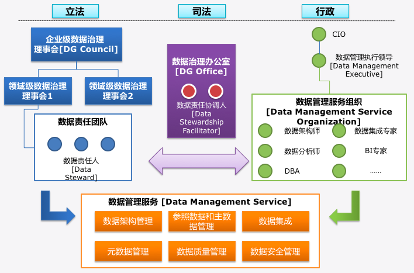

# 1.企业面临的挑战

	
# 2.什么是数据治理

数据治理(Data Governance)涵盖了人员，流程和技术，是一系列改变数据使用行为的过程，它从根本上改变业务和信息技术的使用方法。 

   
数据治理是一套持续改善管理机制，通常包括了数据架构组织、数据模型、政策及体系制度、技术工具、数据标准、数据质量、影响度分析、作业流程、监督及考核等内容。

# 3.数据治理的组织架构

# 4.数据治理核心内容

数据治理的三大核心环节标准管理、元数据管理、数据质量管理，基于此上，经历一系列落地应用，将数据标准应用于系统需求、设计、维护环节，规范数据的生产、应用与管理。

# 5.数据治理产品支持

# 6.数据治理技术

## 6.1 元数据
通俗的讲元数据就是用来描述上下文的信息，帮助人们更好的理解和使用数据的一组信息。

## 6.2 元数据管理范围

| 源系统信息 | ETL过程 | 数据仓库信息 | 应用服务层信息 |门户管理 |
|:-------|:------------- | :----------|:----------|:----------|
|  系统运行结构    技术数据结构   业务数据结构  |  DW映射关系   ETL程序信息   数据转换规则   数据清洗规则 |  数据仓库数据处理流程   DW物理模型数据结构   数据字典及敏感级别   程序库   数据库目录 |  KPI关键业务指标   数据分析模型   数据库目录 | 安全认证   访问控制   帮助文档结构 |

## 6.3 元数据的关系链路

* 建立元数据的关系链路

　使用SQLParse解析ETL中的SQL脚本

		例如: insert into t_user_info(id1,name1,age1) select id2,name2,age2 from s_user_info
		经过SQLParse解析后，建立表级和字段级元数据关系。
		表级
			t_user_info   ---依赖-> s_user_info
		字段级
			id1  ---依赖-> id2        name1 ---依赖-> name2      age1 ---依赖-> age2 

* 元数据关系链路的应用-血统图

		1.通过链路图可以看到相关联的下游系统。

		2.可以看到数据的生成方式。

		3.可以看到数据表取数来源。

		4.可以看到ETL数据加工来源。

		5.数据加工质量告警。

* 元数据的关系应用—影响图

		1.变动系统会影响的上游系统。
		
		2.系统上线变动已有系统数据表结构，根据影响分析获取影响的系统，提前告知。结合模型上线审批流程，可以规范系统上线流程。

# 6.4 数据标准

## 6.41数据标准定义
 对业务需求和数据仓库建设过程中所涉及的数据信息进行梳理，形成整套企业数据标准。数据标准用元数据工具进行承载、管理、维护和更新。
 	 
## 6.42数据标准包括  
基础标准、标准代码、标准代码值

1.基础标准的业务属性

可以统一企业的业务口径，作为业务部门的业务字典

1.基础标准的技术属性作用

在源系统向数据仓库通过ETL加载数据时，起数据校验和最终数据质量判定作用。

通过数据标准的技术属性可以规范源系统物理模型设计。

取数据标准在通过数据标准的稽核可以获源系统的分布和使用情况，为更好的进行数据治理工作提供依据。

2.基础标准归属主题

IBM金融数据模型数据存储模型 FSDM(financial services datamodel)，是金融行业应用极为广泛的数据模型，可以作为构建企业级数据仓库主题域模型划分的重要依据

## 6.43 数据标准的实施方法论

## 6.43 数据标准的梳理

# 7 数据质量

数据质量定义为数据的“适用性（fitness for use）”，即数据满足使用需要的合适程度

数据质量的度量是用数据的一组固有特性来衡量满足要求的程度，也就是数据的优劣程度 

	
	

## 7.1 数据质量包含内容

* 数据质量监控：提供日常数据质量监控信息采集、规则监控、问题告警、问题申告处理、质量报告、知识沉淀及任务调度等
* 数据质量检测：提供对批量业务数据快速质量评估功能。
* 编码质量评估：提供对多类系统编码数据质量评估功能
* 数据质量全景展示，提供基于元数据地图的数据质量监控链路展示功能
