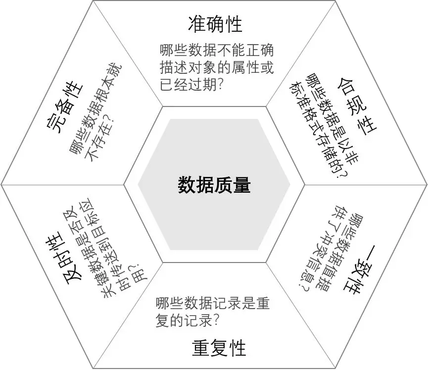
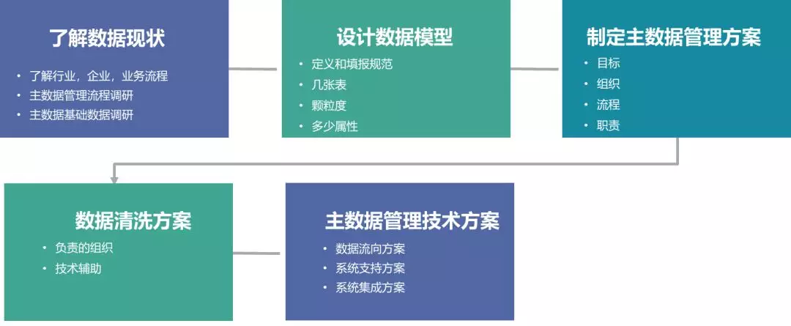
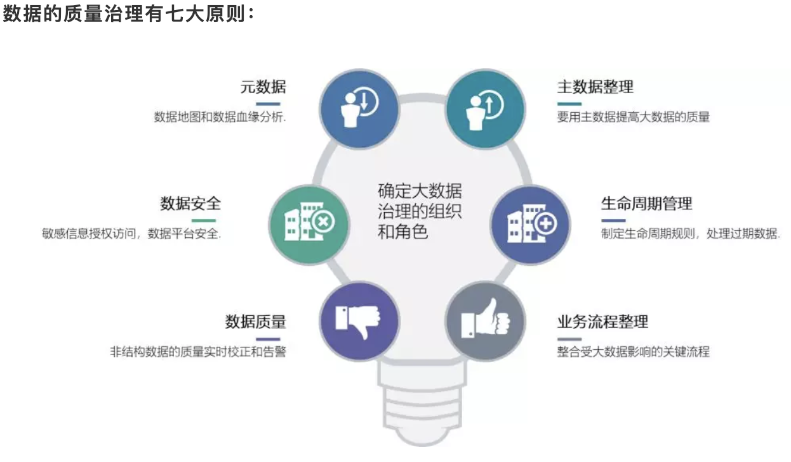

# 数据质量
> 由于滥用缩写词，惯用语，数据输入错误，重复记录，丢失值，拼写变化，不同的计量单位，大量应用系统产生的大量数据是脏数据。

## 数据质量问题的四个因素

### 1.信息因素
产生这部分数据质量问题的原因主要有：元数据描述及理解错误，数据质量的各种性质（如：数据源规格不统一）得不到保证和变化频度不恰当。

### 2.管理因素
是指由于人员素质及管理机制方面的原因造成的数据质量问题。如人员培训，人员管理，培训或者奖惩措施不当导致的管理缺失或者管理缺陷。

### 3.技术因素
主要是指由于具体数据处理的各技术环节异常造成的数据质量问题。数据质量问题的产生环节主要包括数据创建、数据获取、数据传输、数据装载、数据使用、数据维护等方面的内容。

### 4.流程因素
是指由于系统作业流程和人工操作流程设置不当而造成的数据质量问题，主要来源于系统数据的创建流程、传递流程、装载流程、使用流程、维护流程和稽核流程等各环节。
## 数据质量问题解决方案

>从上述的四因素来说，管理因素和流程因素属于组织管理范畴，信息因素和技术因素属于技术范畴。所以，要改进数据质量问题，要从组织管理和技术两方面入手，才能从根本上，最佳地解决数据质量问题。

从方法论的角度，从组织管理上去改进质量，我们能做的是：

- 确立组织数据质量改进目标

- 评估组织流程

- 制定组织流程改善计划

- 实施改进

- 评估改善效果

从技术上去改进数据质量，我们能做的是：

- 数据分析

- 数据评估

- 数据清洗

- 数据监控

- 错误预警

## 数据质量的六大标准

## 主数据和行为数据

通常在业务系统存在两大类型数据：主数据和行为数据。主数据是描述事物主体的数据比如人，商品等，行为数据围绕主数据描述的事物发生的行为数据比如交易订单数据，日志数据等。所以，数据治理的改进的核心在于主数据质量改进，只有改进了主数据质量，才能有可能把整体业务数据质量提升上去。
## 主数据治理
主数据质量治理的目标是把各个业务系统低质量的基础数据，经过质量治理，形成统一规范的主数据，然后反馈给业务系统和其他数据应用系统使用。

- 让数据规范起来（得到所有相关人员的认可——元数据）

- 得到一份标准的数据（主数据）

- 建立一套体系来维护数据（主数据管理体系——数据治理）

## 主数据管理

### 1.了解数据现状

>当前有多少数据？数据模型是什么样子？涉及到哪些业务部门和角色？有什么样的维护流程和体系？数据在哪个或者哪些系统中录入？数据如何流转？数据质量如何？共享质量如何？...

可通过以下两种方式对当前数据现状进行调研了解：

管理流程调研：管理流程调研按照人员，组织，客商，物料，产品，资产，项目以及合同等分成多个子项目。根据企业需要，选择一些做调研。

基础数据调研：主要是调研的是当前的数据在哪里？哪个部门管？怎么管？数据量有多大？数据格式是什么？数据质量如何？

### 2. 设计数据模型

>数据定义是什么？数据到底有几个模型？每个模型中有几个字段？每个字段的含义是什么？这里主要讨论基础的数据建模，即确定主数据的属性数量，名称，属性数据类型及长度等信息。

主数据定义：定义需要明确和清晰。定义关系到数据范围和数据量，关系到与其他主数据的关系。比如人员主数据是指所有与**公司签署了正式劳动合同的人员。人员主数据是从企业管理视角出发的人员实体的数字化描述。

主数据中表的颗粒度：是用一张表还是多张表描述实体，这决定主数据中表与表之间存在1:1，1：N，N:M的各种关系。

主数据中字段属性的颗粒度：根据实际的业务需求，定义字段属性的颗粒度，颗粒度细，则数据量大。反之，则少。

遵循的原则：权威原则、全局性原则、共享性原则、扩展性原则。

- 权威原则

主数据的数据设计具有权威性，原则上应当根据企业的业务架构推导而出，企业的各个应用系统应当在主数据设计基础上进行承接和支撑，满足企业主数据模型要求。

- 全局性原则

只定义全局属性，不定义某个业务领域中所特有的私有属性。

- 共享性原则

主数据定义中，如果某个属性出现在两个或者多个系统中，建议这个属性定义为主数据项。

- 扩展型原则

主数据数据项会在未来应用中存在扩展需求。主数据数据项在定义时应当考虑未来扩展。主数据数据项定义时应当遵守开闭原则，即对扩展开放对修改关闭，凡是已经定义的主数据数据项原则上不应当再次修改。

### 3.制作主数据管理方案
>哪个部门，哪个岗位，在什么时候，依据什么进行主数据维护？

- 建立数据管理的虚拟组织，找到对数据负责的人。每个主数据都要有一个或者多个业务部门对数据负责，不是信息中心。信息中心仅对数据本身负责。

- 定义数据管理组织的管理职责。针对每个数据的每个字段，都应当回答，谁，在什么场景，依据什么，是否多人和有流程对内容进行管理和维护。

### 4.数据清洗方案

当前存在的数据如何变成标准主数据的过程。

- 责任部门负责数据清洗和对数据质量负责，其他部门进行协助

- 根据数据质量情况决定组织模式，必要时需要“运动会”模式

- 提前就数据要求，填报规范做充分培训

- 采用大数据平台做清洗的技术手段，可以有无限扩张的计算和存储能力，很好的解决清洗数据中的计算资源消耗问题

### 5.主数据管理技术方案

**数据流向方案**

  数据的入口在哪里，主数据系统中的数据分发给哪些系统

**系统支持方案**

  数据在哪个系统中录入

**系统集成方案**

   主数据服务规范，第三个系统改造内容
   
   
**大数据的质量改进主要是通过数据中台的数据清洗，ID Mapping等技术来解决。**

