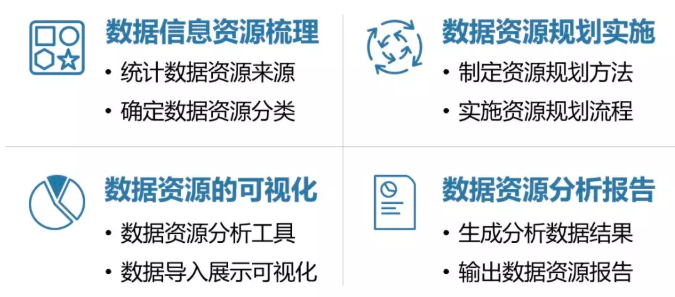
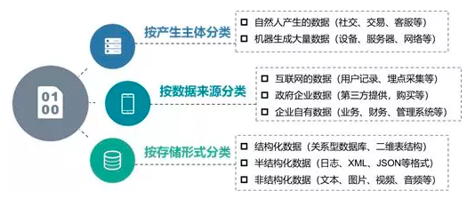
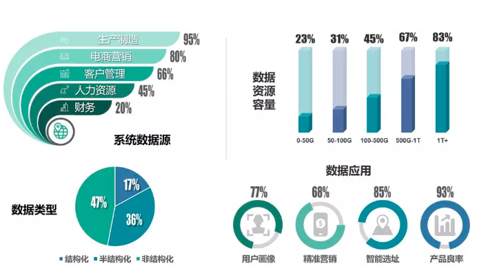

# 数据资源规划与获取

>数据资源规划是数据治理，数据建模，数据资产管理，数据指标体系规范等工作的前置环节和必要条件，因此数据资源规划的作用至关重要，包括数据资源梳理、数据资源规划实施、数据资源可视化、数据资源分析报告四部分内容。

**数据资源规划流程**

## 数据资源梳理
即企业需要梳理清楚：数据来自谁，用在何处，如何存储？一般而言，业内会从三个维度，来对数据资源进行分类管理，数据产生主体、数据来源、存储形式等。

GDPR(General Data Protection Regulation,一般数据保护法案)规定企业必须明确满足数据主体的信息权，获取权，纠正权，限制处理权，反对权，删除权和数据可移动权等。

## 数据资源规划实施

企业在数据资源规划与获取的过程中，除了需要企业内部提供有效的组织保障，包括数据管理人员、数据分析人员和业务使用人员之间的紧密协作，而且还需要全面的对整个企业或政府部门组织需求分析调研，这样才可有效帮助企业理清数据资源家底，明确数据资源获取与使用的方式方法。

## 数据资源可视化

>现有数据资源梳理结果进行可视化呈现，让各子公司、各部门、各业务需求方都可以清晰了解自身数据资源现状，以及要满足自身数据应用需求，还需要获取哪些数据资源，还需要增加多少量的数据存储空间，还需要补充哪些外部数据，现有数据质量又如何,则可以大规模提高企业数据资源利用的效率。

