# 标签体系
## 做标签画像的目的

### 􏴨􏴩􏳫􏳙􏲯􏳂􏵫􏲠􏵬􏶹􏵁1.精细化客户生命周期管理

根据用户行为和状态特征，制定客户生命周期管理模型，监控用户阶段变化情况，更好的挖掘价值用户的需求，防止流失，召回
   
### 2.高价值客户深入开发
多维度挖掘不同交易行为模式的用户群，如找到重要保持客户，重要挽留客户等不同类型的用户群，并充分授信，对该类客户做精细化的运营。

### 3.交叉营销
跟于某类已完成目标人群的标签特征，去全量用户中，对未完成目标的人群且具有相同标签特征的人进行提取营销，比如针对潜在理财客户的营销。

### 4.个性化推送
根据客户的年龄，风险偏好，交易偏好等多个维度的标签，对不同的用户群进行精准定位，分析出其潜在的服务需求，进而有针对性的营销推送，提升体验

### 5.个性化推荐
不管是为了提升活跃还是交易转化，维度丰富的用户标签数据，以及结合交易类型或资讯本身的标签数据，对实现个性化的用户页面推荐，都至关重要。

### 6.个性化实时营销

根据用户的实时状态，行为与标签的迁移来进行营销，比如对未完成的交易用户做准时的推送。

## 标签画像应用

### 1.精细化运营

从粗放式到精细化，将用户群体切割成更细的粒度，辅以短信，推送，邮件，活动等手段，驱以关怀，挽回，激励等策略

### 2.数据分析

标签可以理解作为用户分层分类的规则之一，数据查询平台和这些数据打通后能支持更加丰富和深层的分析和对比

### 3.用户分析
用户画像也是了解用户的必要补充，在产品用户量扩大后，需要辅以用户画像配合研究，如新增的用户有什么特征，核心用户的属性是否变化等。

### 4.产品应用
用户标签是很多数据产品的基础，诸如个性推荐系统广告系统，个性化推荐系统，CRM基础搭建等

### 精细化运营举例

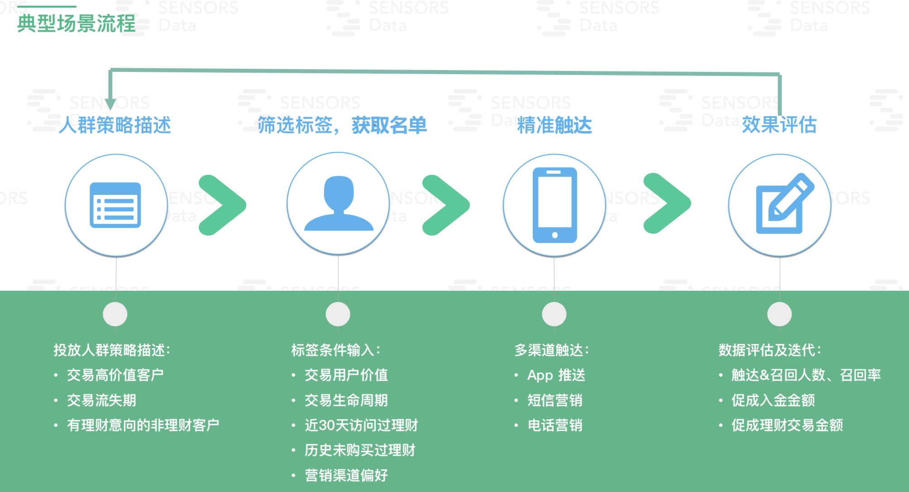

## 如何构建一个完成的标签体系

> 好的标签设计 应具有以下特征

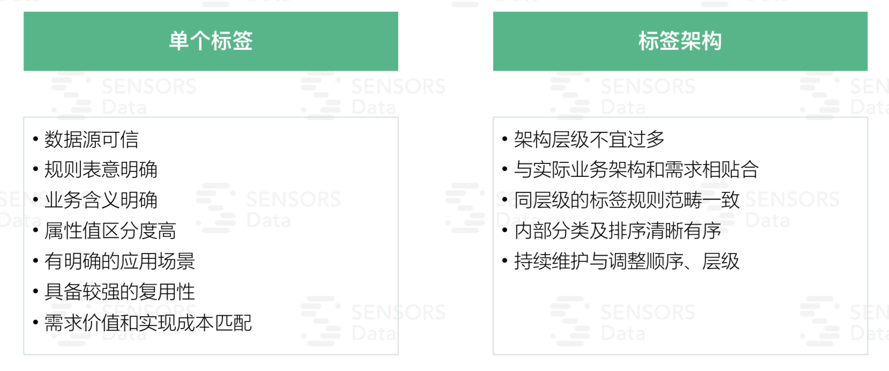

### 1. 了解标签的获得形式

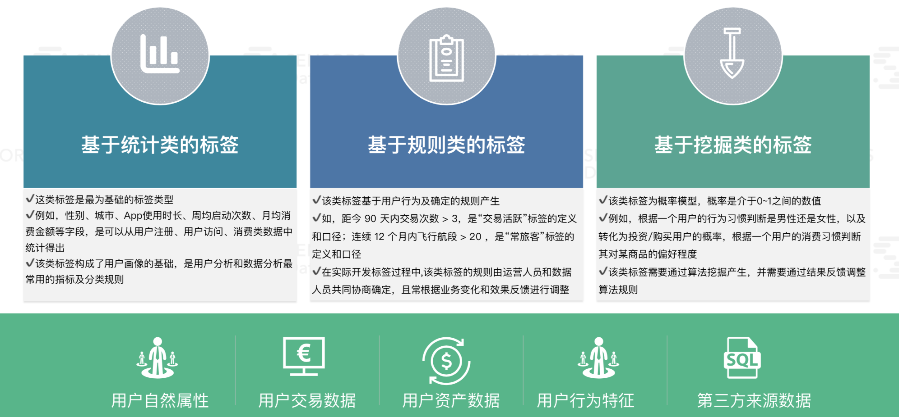

### 2.标签体系建设方法论

>在电商这个场景下，我们构建用户标签体系主要根据用户在历史时间内的网购行为记录，从网购时间点、内容深度剖析，针对用户的基础属性、社交行为、互动行为、消费行为、偏好习惯、财富属性、信用属性和地理属性等八大维度构建用户标签体系，以期综合描绘平台消费者的行为特征。

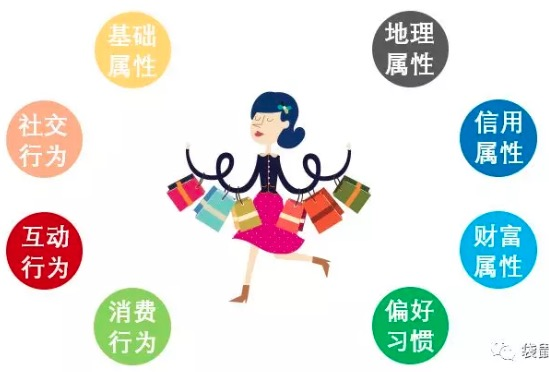

**建设过程分为6个基本步骤**

1. 首先以业务视角梳理规划整个标签体系的架构，即上面所说的八个维度

2. 无规矩不成方圆，在进行实际开发之前，我们要定义包括数据（指标）规范、模型设计规范、ETL规范在内的规范体系。

3. 将分散在各个系统/应用的数据同步到大数据开发平台之上，包括结构化的业务数据、埋点采集的行为日志数据等

4. 核心围绕“用户”，以唯一标识打通来自不同平台、系统、渠道的数据，基于OneData体系依次构建全域数据中心、萃取数据中心

5. 在萃取数据中心基础上，进行各类标签的研发，例如事实类标签（性别、年龄段等）、业务类标签（钻石会员、普通会员等）、统计类标签（近90天下单金额等）、算法类标签（重要保持客户、高忠诚度客户等）

6. 标签/画像投入应用，或对接至下游业务系统，产生业务价值。与此同时监控各类标签的使用与效果，统计出热门标签，替换掉不合理的标签，调整业务算法和规则，添加新的标签等，来进一步推动标签体系的梳理规划，逐步沉淀一套精华版标签集合

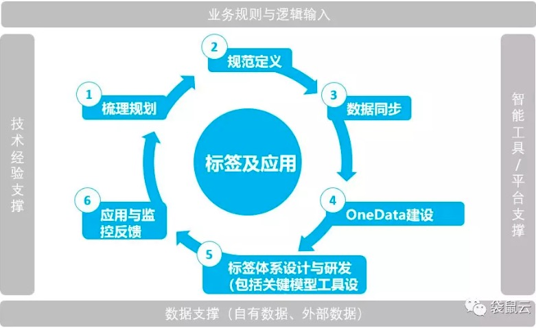

### 3. 清楚业务形态，以商业目的出发，汇集标签

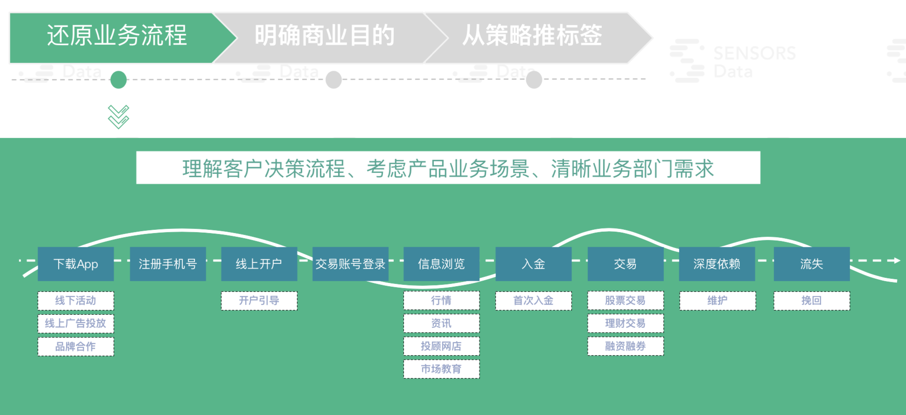

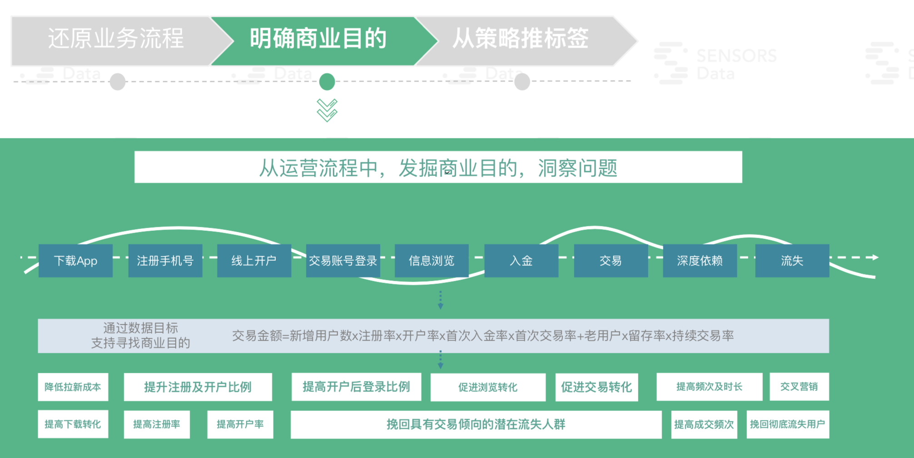

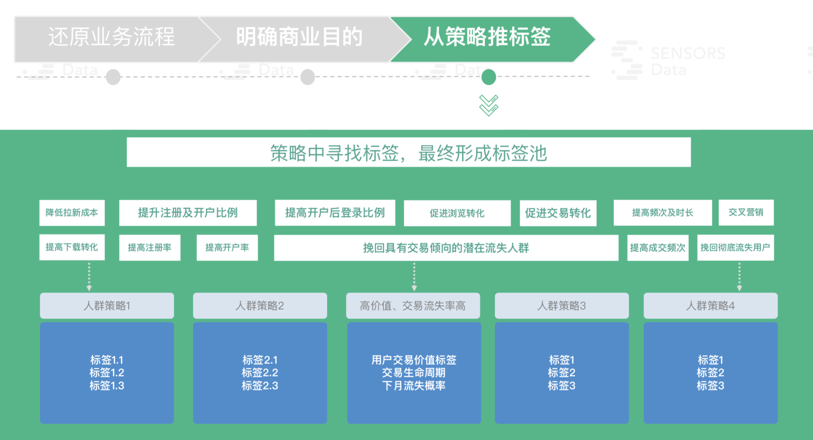

### 4. 对标签池进行分类和定义

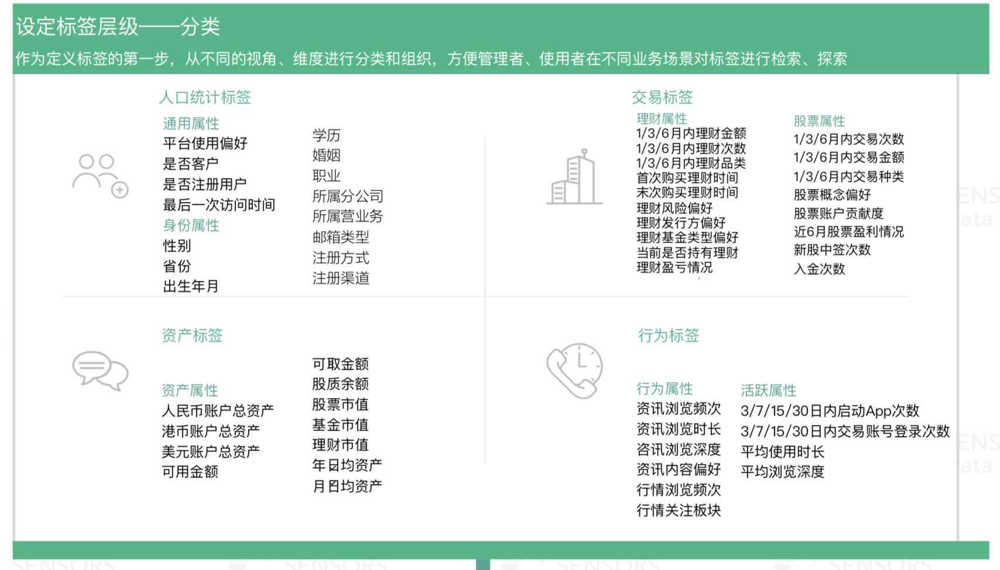

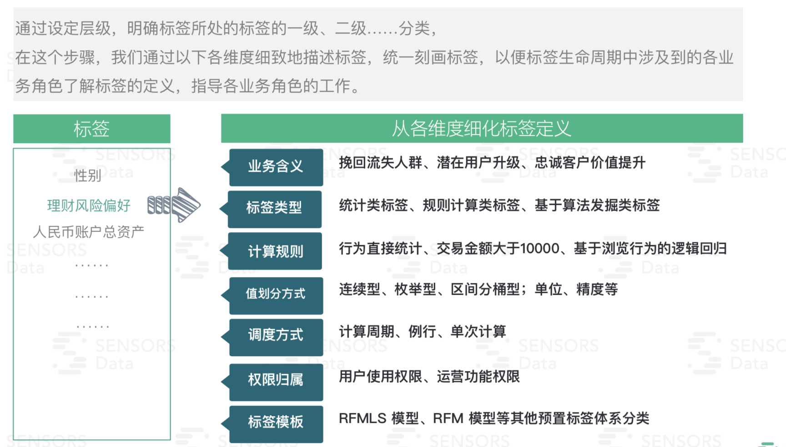

### 5. 标签的维护

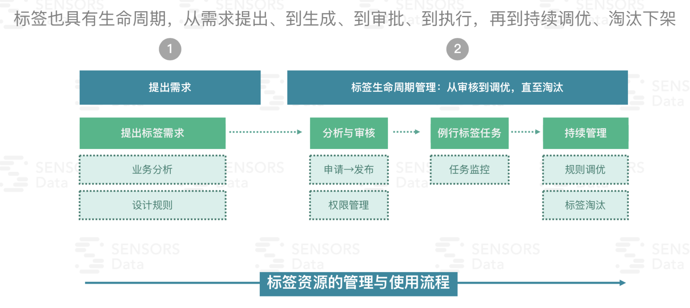

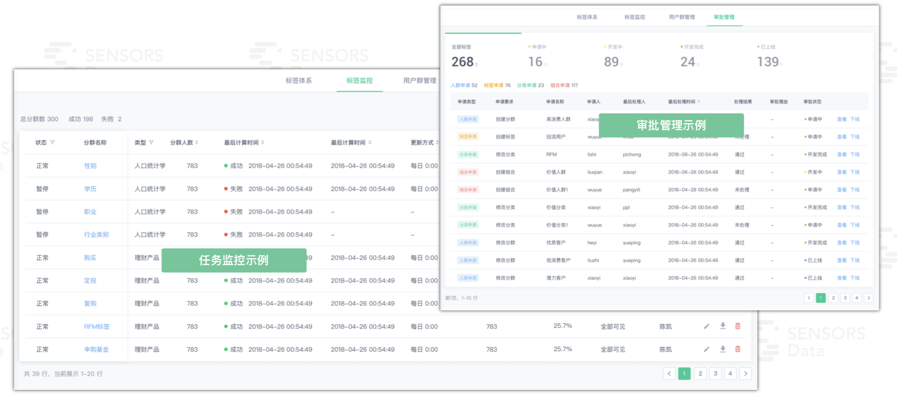

