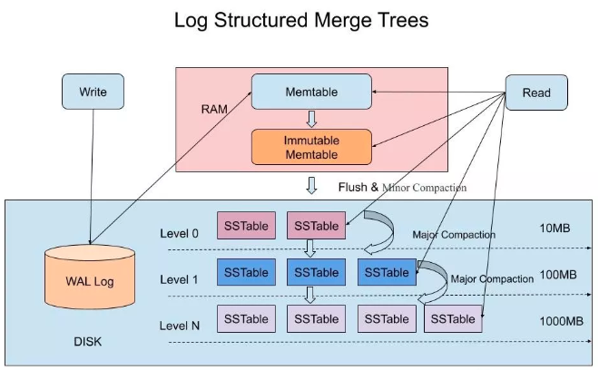
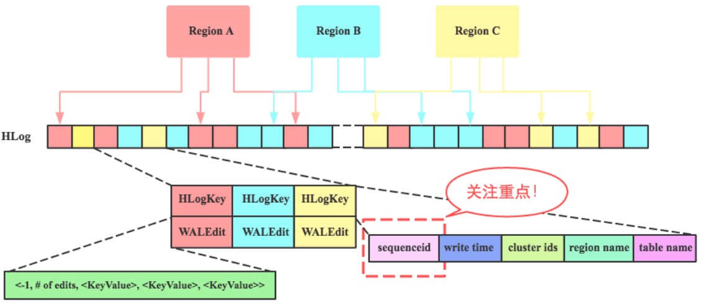
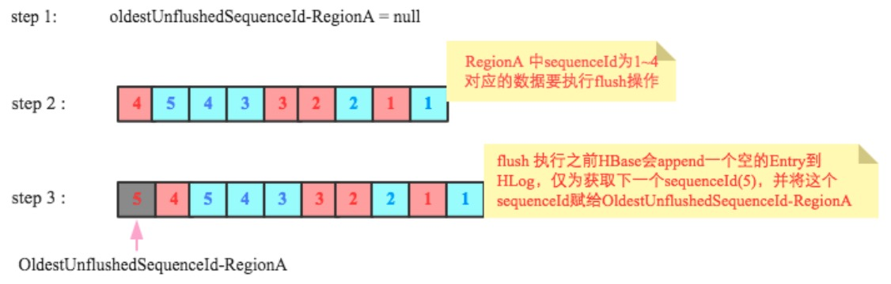

# hbase体系

## 1.基础概念

### 1.1 优势和应用场景

**特点和优势**

- 分布式，多版本，面向列的开源数据库
- 支持上亿行，百万列
- 强一致
- 高可用
- 高拓展

**应用场景**

- 以实体为中心

	1. 自然人／账户／手机号／车辆相关数据

	2. 用户画像数据（含标签类数据）

	3. 图数据（关系类数据）

- 以事件为中心

	1. 监控数据

	2. 时序数据

	3. 实时位置类数据

	4. 消息/日志类数据

### 1.2 数据模型
#### 1.2.1 RowKey

- 排序：字典序

- RowKey设计
	- 反转
	- 加盐
	- 哈希
	- 组合

#### 1.2.2 稀疏矩阵

每一行中，列的组成都是灵活的，行与行之间并不需要遵循相同的列定义， 也就是HBase数据表"schema-less"的特点。

### 1.2.3 Schema
**创建**

	Configuration config = 	HBaseConfiguration.create();
	HBaseAdmin admin = new HBaseAdmin(config);
	String table = "Test";
	admin.disableTable(table);        // 将表下线
	HColumnDescriptor f1 = ...;
	admin.addColumn(table, f1);      // 增加新的列族
	admin.enableTable(table);
**修改时机**

当表或者列族改变时（包括：编码方式、压缩格式、block大小等等），都将会在下次marjor compaction时或者StoreFile重写时生效

**列族**

如果将Region看成是一个表的横向切割，那么，一个Region中的数据列的纵向切割，称之为一个Column Family。每一个列，都必须归属于一个Column Family，这个归属关系是在写数据时指定的，而不是建表时预先定义。

1. 基数：如果一个表存在多个列族，要注意列族之间基数(如行数)相差不要太大。 例如列族A有100万行，列族B有10亿行，按照行键切分后，列族A可能被分散到很多很多region(及RegionServer)，这导致扫描列族A十分低效。
	
2. 数量：一个典型的表中含有1-3个列族

	原因：flush 和 compaction 操作是针对一个region。所以当一个列族操作大量数据的时候会引发一个flush。那些邻近的列族也有进行flush操作，尽管它们没有操作多少数据。
	当很多的列族在flush和compaction时,会造成很多没用的I/O负载(要想解决这个问题，需要将flush和compaction操作只针对一个列族) 。
	
3. 存活时间：列族可以设置TTL秒数，HBase在超时后将自动删除数据

4. 列的版本：列的版本的数量是HColumnDescriptor设置的，每个列族可以单独设置，默认是3。这个设置是很重要的，因为HBase是不会去覆盖一个值的，它只会在后面在追加写，用时间戳来区分、过早的版本会在执行major compaction时删除，这些在HBase数据模型有描述。这个版本的值可以根据具体的应用增加减少。

**表的组织结构**

图一HBase中的一个表，由两个列族（Personal和Office）组成，每个列族都有两列。 包含数据的实体称为单元格,行根据行键进行排序。

为了更好的理解HBase中的多维数据存储模型，这里从上图的表中摘出一条数据，将它在HBase的表中的存储转化成如图二所表示的形式去理解他。

### 1.3 访问方式

#### 1.3.1 接口类型

1. Java Client

2. HBase Shell

3. RestFull Api

4. Thrift：
	Thrift是一种接口描述语言和二进制通讯协议，它被用来定义和创建跨语言的服务。
	
	
5. Spark/MR：Spark接口在Hbase 3.0 中开始提高支持

#### 1.3.2 连接方式

- **同步**： Table

- **异步**： AsyncTable

### 1.4 劣势

1. 无法发挥新存储介质IO优势

2. 低CPU使用率

3. 故障恢复耗时

4. 读取性能与数据本地化率强相关

# 2.架构与原理

## 2.1 架构图

相信大部分人对这些角色都已经有了一定程度的了解，我们快速的介绍一下各个角色在集群中的主要职责：

- ZooKeeper

	在一个拥有多个节点的分布式系统中，假设，只能有一个节点是主节点，如何快速的选举出一个主节点而且让所有的节点都认可这个主节点？这就是HBase集群中存在的一个最基础命题。

	利用ZooKeeper就可以非常简单的实现这类"仲裁"需求，ZooKeeper还提供了基础的事件通知机制，所有的数据都以 ZNode的形式存在，它也称得上是一个"微型数据库"。

- NameNode

	HDFS作为一个分布式文件系统，自然需要文件目录树的元数据信息，另外，在HDFS中每一个文件都是按照Block存储的，文件与Block的关联也通过元数据信息来描述。NameNode提供了这些元数据信息的存储。
	
- DataNode

	HDFS的数据存放节点。
	
- RegionServer

	HBase的数据服务节点。
	
	1. 从图中可以看出，HRegionServer是HBase的数据服务进程，处理⽤用户所有的读写请求

	2. 负责管理Region，处理对Region的IO请求

	3. 负责切分Region，如果Region的大小超出了⼀一定的阀值，那么将其切分为多个

	4. RegionServer推荐管理1000个左右的Region

- Region

	1. Region负责Rowkey数据的存储，在HBase数据表中按照RowKey的范围划为一个的Region，实现分布式的存储，每一个Region都关联一个Rowkey的范围（StartKey-EndKey)(可以参考HBase细节概要篇)

	2. Region是Hbase的最小单元

	3. Region分为Meta Region和User Region，Meta Region纪录了每一个User Region的路由信息，首先读写Region会⾸首先经过路由，1，寻找Meta Region 2，由Meta Region找到User Region

	4. Region由多个Store组成

- Master

	HBase的管理节点，通常在一个集群中设置一个主Master，一个备Master，主备角色的"仲裁"由ZooKeeper实现。 Master主要职责：

	①负责管理所有的RegionServer。

	②建表/修改表/删除表等DDL操作请求的服务端执行主体。

	③管理所有的数据分片(Region)到RegionServer的分配。

	④如果一个RegionServer宕机或进程故障，由Master负责将它原来所负责的Regions转移到其它的RegionServer上继续提供服务。

	⑤Master自身也可以作为一个RegionServer提供服务，该能力是可配置的。

## 2.2 概念和原理

### 2.2.1 LSM-Tree

>LSM-Tree全称是Log Structured Merge Tree，是一种分层，有序，面向磁盘的数据结构，其核心思想是充分了利用了，磁盘批量的顺序写要远比随机写性能高出很多

在LSM-Tree里，SSTable有一份在内存里面，其他的多级在磁盘上，如下图是一份完整的LSM-Tree图示：

#### 2.2.1.1 HLog

HBase中HLog文件的基本结构

***WAL***

WAL(Write-Ahead-Log)预写日志是HBase的RegionServer在处理数据插入和删除的过程中用来记录操作内容的一种日志。在每次Put、Delete等一条记录时，首先将其数据写入到RegionServer对应的HLog文件的过程。 

***SequenceId***

sequenceid是region级别一次行级事务的自增序号。

1. sequenceid是自增序号。很好理解，就是随着时间推移不断自增，不会减小。

2. sequenceid是一次行级事务的自增序号。行级事务是什么？简单点说，就是更新一行中的多个列族、多个列，行级事务能够保证这次更新的原子性、一致性、持久性以及设置的隔离性，HBase会为一次行级事务分配一个自增序号。

3. sequenceid是region级别的自增序号。每个region都维护属于自己的sequenceid，不同region的sequenceid相互独立。

在这样的定义条件下，HLog就会如下图所示：

***问题一：HLog在什么时候可以过期回收？***

下图中虚线右侧部分为超过单个HLog大小阈值后切分形成的一个HLog文件，问题是这个文件什么时候可以被系统回收删除。理论上来说只需要这个文件上所有Region对应的最大sequenceid已经落盘就可以删除，比如下图中如果RegionA对应的最大sequenceid(5)已经落盘，同时RegionB对应的最大sequenceid(5)也落盘，那该HLog就可以被删除。那怎么实现的呢？

RegionServer会为每个Region维护了一个变量oldestUnflushedSequenceId（实际上是为每个Store，为了方便讲解，此处暂且认为是Region，不影响原理），表示这个Region最早的还未落盘的seqid ，即这个seqid之前的所有数据都已经落盘。接下来看看这个值在flush的时候是怎么维护的，以及如何用这个值实现HLog的过期回收判断。

下图是flush过程中oldestUnflushedSequenceId变量变化的示意图，初始时为null，假设在某一时刻阶段二RegionA(红色方框)要执行flush，中间HLog中sequenceId为1~4对应的数据将会落盘，在执行flush之前，HBase会append一个空的Entry到HLog，仅为获取下一个sequenceId(5)，并将这个sequenceId赋给OldestUnflushedSequenceId-RegionA。如图中第三阶段OldestUnflushedSequenceId-RegionA指向sequenceId为5的Entry。

可见，每次flush之后这个变量就会往前移动一段距离。这个变量至关重要，是解决文初提到的三个问题的关键。基于上述对这个变量的理解，来看看下面两种场景下右侧HLog是否可以删除：

很显然，场景一中右侧HLog还有未落盘的数据（sequenceid=5还未落盘），因此不能删除；而场景二中右侧HLog的所有数据都已经落盘，所以这个HLog理论上就已经可以被删除回收。

***问题二：HLog数量超过阈值(maxlogs)之后删除最早HLog，应该强制刷新哪些Region？***

假设当前系统设置了HLog的最大数量为32，即hbase.regionserver.maxlogs=32，上图中最左侧HLog是第33个，此时系统会获取到最老的日志（最右侧HLog），并检查所有的Entry对应的数据是否都已经落盘，如图所示RegionC还有部分数据没有落地，为了安全删除这个HLog就必须强制对本HLog中多个Region执行flush操作，将所有数据落盘。

***问题三：RegionServer宕机恢复replay日志时哪些WALEntry需要被回放，哪些会被skip？***

理论上来说只需要回放Memstore中没有落地的数据对应的WALEntry，已经落地数据对应的WALEntry可以skip。可问题是RegionServer已经宕机了，<region, oldestUnflushedSequenceId> 对应信息肯定没有了，如何是好？想办法持久化呗，上文分析oldestUnflushedSequenceId变量是flush时产生的一个变量，这个变量完全可以以flush的时候以元数据的形式写到HFile中（代码见下图）：

这样Region在宕机迁移重新打开之后加载HFile元数据就可以恢复出这个核心变量oldestUnflushedSequenceId（本次flush所生成的所有HFlie中都存储同一个sequenceId），这个sequenceId在恢复出来之后就可以用来在回放WALEntry的时候过滤哪些Entry需要被回放，哪些会被skip。

#### 2.2.1.2 HFile

***SSTable***

>sstable（Sorted String Table）是拥有持久化，有序且不可变的键值存储结构，他的key和value都是任意的字节数组

SSTable是一种拥有持久化，有序且不可变的的键值存储结构，它的key和value都是任意的字节数组，并且了提供了按指定key查找和指定范围的key区间迭代遍历的功能。

SSTable内部包含了一系列可配置大小的Block块，典型的大小是64KB，关于这些Block块的index存储在SSTable的尾部，用于帮助快速查找特定的Block。

当一个SSTable被打开的时候，index会被加载到内存，然后根据key在内存index里面进行一个二分查找，查到该key对应的磁盘的offset之后，然后去磁盘把响应的块数据读取出来。

当然如果内存足够大的话，可以直接把SSTable直接通过MMap的技术映射到内存中，从而提供更快的查找。

***KeyValue***

Key组成：
	RowKey，ColumnFamily，Qualifier ，TimeStamp，KeyType等多部分组成

Value内容：
	value是一个简单的二进制数据。

Key中元素KeyType表示该KeyValue的类型，取值分别为Put/Delete/Delete Column/Delete Family等。

- 表： 表的作用将存储在HBase的数据组织起来。

- 行： 行包含在表中，数据以行的形式存储在HBase的表中。HBase的表中的每一行数据都会被一个唯一标识的行键标识。行键没有数据类型，在HBase存储系统中行键总是被看作一个byte数组。

- 列族： 在行中的数据都是根据列族分组，由于列族会影响存储在HBase中的数据的物理布置，所以列族会在使用前定义（在定义表的时候就定义列族），并且不易被修改。
在HBase的存储系统中数据存储在相同的表中的所有行的数据都会有相同的列族（这和关系型数据库的表一样，每一行数据都有相同的列）。

- 列限定符： 存储在在列族中的数据通过列限定符或列来寻址的，列不需要提前定义（不需要在定义表和列族的时候就定义列），列与列之间也不需要保持一致。列和行键一样没有数据类型，并且在HBase存储系统中列也总是被看作一个byte数组。

- 单元格： 根据行键、列族和列可以映射到一个对应的单元格，单元格是HBase存储数据的具体地址。在单元格中存储具体数据都是以Byte数组的形式存储的，也没有具体的数据类型。

- 时间戳： 时间戳是给定值的一个版本号标识，每一个值都会对应一个时间戳，时间戳是和每一个值同时写入HBase存储系统中的。在默认情况下，时间戳表示数据服务在写入数据时的时间，但可以在将数据放入单元格时指定不同的时间戳值。

***KeyValue排序***

HBase的key的排序：

HBase设定Key大小首先比较RowKey，RowKey越小Key就越小；RowKey如果相同就看CF，CF越小Key越小；CF如果相同看Qualifier，Qualifier越小Key越小；Qualifier如果相同再看Timestamp，Timestamp越大表示时间越新，对应的Key越小。如果Timestamp还相同，就看KeyType，KeyType按照DeleteFamily -> DeleteColumn -> Delete -> Put 顺序依次对应的Key越来越大

***KeyValue排序的原因***

通过比较大小不仅可以scan的结果需要由小到大输出给用户而且能够提高查询效率，举个简单的例子，HBase支持数据多版本，假设用户只想获取最新版本，那只需要将这些数据由最新到最旧进行排序，然后取队首元素返回就可以。

假设用户只想获取最新版本，那只需要将这些数据由最新到最旧进行排序，然后取队首元素返回就可以。那么，如果不排序，就只能遍历所有元素，查看符不符合用户查询条件。这就是排队的意义。

#### 2.2.1.3 写

***写流程***

我们总结下在在LSM-Tree里面如何写数据的？

1. 当收到一个写请求时，会先把该条数据记录在WAL Log里面，用作故障恢复。

2. 当写完WAL Log后，会把该条数据写入内存的SSTable里面（删除是墓碑标记，更新是新记录一条的数据），也称Memtable。注意为了维持有序性在内存里面可以采用红黑树或者跳跃表相关的数据结构。

3. 当Memtable超过一定的大小后，会在内存里面冻结，变成不可变的Memtable，同时为了不阻塞写操作需要新生成一个Memtable继续提供服务。

4. 把内存里面不可变的Memtable给dump到到硬盘上的SSTable层中，此步骤也称为Minor Compaction，这里需要注意在L0层的SSTable是没有进行合并的，所以这里的key range在多个SSTable中可能会出现重叠，在层数大于0层之后的SSTable，不存在重叠key。

5. 当每层的磁盘上的SSTable的体积超过一定的大小或者个数，也会周期的进行合并。此步骤也称为Major Compaction，这个阶段会真正 的清除掉被标记删除掉的数据以及多版本数据的合并，避免浪费空间，注意由于SSTable都是有序的，我们可以直接采用merge sort进行高效合并。

***Flush***

2.0 以前的flush：MemStore中的数据，达到一定的阈值，被Flush成HDFS中的HFile文件。

2.0以后的flush（新特性***In-memory Flush and Compaction***）MemStore中的数据先Flush成一个Immutable的Segment，多个Immutable Segments可以在内存中进行Compaction，当达到一定阈值以后才将内存中的数据持久化成HDFS中的HFile文件。

***compaction***

HFile为什么要compaction

图中说明了从一个文件中指定RowKey为“66660000431^201803011300”的记录，以及从两个文件中读取该行记录的区别，明显，从两个文件中读取，将导致更多的IOPS。这就是HBase Compaction存在的一大初衷，Compaction可以将一些HFile文件合并成较大的HFile文件，也可以把所有的HFile文件合并成一个大的HFile文件，这个过程可以理解为：将多个HFile的“交错无序状态”，变成单个HFile的“有序状态”，降低读取时延。小范围的HFile文件合并，称之为Minor Compaction，一个列族中将所有的HFile文件合并，称之为Major Compaction。除了文件合并范围的不同之外，Major Compaction还会清理一些TTL过期/版本过旧以及被标记删除的数据。

Compaction的本质

- 减少HFile文件数量，减少文件句柄数量，降低读取时延

- Major Compaction可以帮助清理集群中不再需要的数据（过期数据，被标记删除的数据，版本数溢出的数据）

#### 2.2.1.4 读

***BlockCache***

BlockCache是Region Server级别的，一个Region Server只有一个Block Cache，在Region Server启动的时候完成Block Cache的初始化工作

- LruBlockCache
- BucketBlockCache
	- Heap
	- OffHeap
	- File
- LruBlockCache vs BucketBlockCache
- BlockCache & MemeryStore：
	HBase中数据仅仅独立地存在于Memstore和StoreFile中，Blockcache中的数据只是StoreFile中的部分数据（热点数据），即所有存在于Blockcache的数据必然存在于StoreFile中。因此MemstoreScanner和StoreFileScanner就可以覆盖到所有数据。实际读取时StoreFileScanner通过索引定位到待查找key所在的block之后，首先检查该block是否存在于Blockcache中，如果存在直接取出，如果不存在再到对应的StoreFile中读取。
	
***MVCC***

MVCC（Multi-Version Concurrent Control），即多版本并发控制协议，它的目标是在保证数据一致性的前提下，提供一种高并发的访问性能。
	
***读流程***

1. 当收到一个读请求的时候，会直接先在内存里面查询，如果查询到就返回。

2. 如果没有查询到就会依次下沉，知道把所有的Level层查询一遍得到最终结果。

思考查询步骤，我们会发现如果SSTable的分层越多，那么最坏的情况下要把所有的分层扫描一遍，对于这种情况肯定是需要优化的，如何优化？在 Bigtable 论文中提出了几种方式：

- 压缩

SSTable 是可以启用压缩功能的，并且这种压缩不是将整个 SSTable 一起压缩，而是根据 locality 将数据分组，每个组分别压缩，这样的好处当读取数据的时候，我们不需要解压缩整个文件而是解压缩部分 Group 就可以读取。

- 缓存

因为SSTable在写入磁盘后，除了Compaction之外，是不会变化的，所以我可以将Scan的Block进行缓存，从而提高检索的效率

- 索引，Bloom filters

正常情况下，一个读操作是需要读取所有的 SSTable 将结果合并后返回的，但是对于某些 key 而言，有些 SSTable 是根本不包含对应数据的，因此，我们可以对每一个 SSTable 添加 Bloom Filter，因为布隆过滤器在判断一个SSTable不存在某个key的时候，那么就一定不会存在，利用这个特性可以减少不必要的磁盘扫描。

- 合并

这个在前面的写入流程中已经介绍过，通过定期合并瘦身， 可以有效的清除无效数据，缩短读取路径，提高磁盘利用空间。但Compaction操作是非常消耗CPU和磁盘IO的，尤其是在业务高峰期，如果发生了Major Compaction，则会降低整个系统的吞吐量，这也是一些NoSQL数据库，比如Hbase里面常常会禁用Major Compaction，并在凌晨业务低峰期进行合并的原因

### 2.2.2 B+Tree VS LSM-Tree

传统关系型数据采用的底层数据结构是B+树，那么同样是面向磁盘存储的数据结构LSM-Tree相比B+树有什么异同之处呢？

1. LSM-Tree的设计思路是，将数据拆分为几百M大小的Segments，并是顺序写入。

2. B+Tree则是将数据拆分为固定大小的Block或Page, 一般是4KB大小，和磁盘一个扇区的大小对应，Page是读写的最小单位。

3. 在数据的更新和删除方面，B+Tree可以做到原地更新和删除，这种方式对数据库事务支持更加友好，因为一个key只会出现一个Page页里面，但由于LSM-Tree只能追加写，并且在L0层key的rang会重叠，所以对事务支持较弱，只能在Segment Compaction的时候进行真正地更新和删除。

5. 因此LSM-Tree的优点是支持高吞吐的写（可认为是O（1）），这个特点在分布式系统上更为看重，当然针对读取普通的LSM-Tree结构，读取是O（N）的复杂度，在使用索引或者缓存优化后的也可以达到O（logN）的复杂度。

6. 而B+tree的优点是支持高效的读（稳定的OlogN），但是在大规模的写请求下（复杂度O(LogN)），效率会变得比较低，因为随着insert的操作，为了维护B+树结构，节点会不断的分裂和合并。操作磁盘的随机读写概率会变大，故导致性能降低。

7. 还有一点需要提到的是基于LSM-Tree分层存储能够做到写的高吞吐，带来的副作用是整个系统必须频繁的进行compaction，写入量越大，Compaction的过程越频繁。而compaction是一个compare & merge的过程，非常消耗CPU和存储IO，在高吞吐的写入情形下，大量的compaction操作占用大量系统资源，必然带来整个系统性能断崖式下跌，对应用系统产生巨大影响，当然我们可以禁用自动Major Compaction，在每天系统低峰期定期触发合并，来避免这个问题。

阿里为了优化这个问题，在X-DB引入了异构硬件设备FPGA来代替CPU完成compaction操作，使系统整体性能维持在高水位并避免抖动，是存储引擎得以服务业务苛刻要求的关键。

# 3.集群规划

## 3.1 集群业务规划
- 硬盘容量敏感型业务

	这类业务对读写延迟以及吞吐量都没有很大的要求，唯一的需要就是硬盘容量。比如大多数离线读写分析业务，上层应用一般每隔一段时间批量写入大量数据，然后读取也是定期批量读取大量数据。特点：离线写、离线读，需求硬盘容量

- 带宽敏感型业务

	这类业务大多数写入吞吐量很大，但对读取吞吐量没有什么要求。比如日志实时存储业务，上层应用通过kafka将海量日志实时传输过来，要求能够实时写入，而读取场景一般是离线分析或者在上次业务遇到异常的时候对日志进行检索。特点：在线写、离线读，需求带宽
- IO敏感型业务

	相比前面两类业务来说，IO敏感型业务一般都是较为核心的业务。这类业务对读写延迟要求较高，尤其对于读取延迟通常在100ms以内，部分业务可能要求更高。比如在线消息存储系统、历史订单系统、实时推荐系统等。特点：在（离）线写、在线读，需求内存、高IOPS介质
## 3.2 集群容量规划

每个季度公司都会要求采购新机器，一般情况下机器的规格（硬盘总容量、内存大小、CPU规格）都是固定的。假如现在一台RegionServer的硬盘规格是3.6T * 12，总内存大小为128G，从理论上来说这样的配置是否会有资源浪费？如果有的话是硬盘浪费还是内存浪费？那合理的硬盘/内存搭配应该是什么样？和哪些影响因素有关？

这里需要提出一个’Disk / Java Heap Ratio’的概念，意思是说一台RegionServer上1bytes的Java内存大小需要搭配多大的硬盘大小最合理。在给出合理的解释在前，先把结果给出来：

Disk Size / Java Heap = RegionSize / MemstoreSize * ReplicationFactor * HeapFractionForMemstore * 2

按照默认配置，RegionSize = 10G，对应参数为hbase.hregion.max.filesize；MemstoreSize = 128M，对应参数为hbase.hregion.memstore.flush.size；ReplicationFactor = 3，对应参数为dfs.replication；HeapFractionForMemstore = 0.4，对应参数为hbase.regionserver.global.memstore.lowerLimit；

计算为：10G / 128M * 3 * 0.4 * 2 = 192，意思是说RegionServer上1bytes的Java内存大小需要搭配192bytes的硬盘大小最合理，再回到之前给出的问题，128G的内存总大小，拿出96G作为Java内存用于RegionServer，那对应需要搭配96G ＊ 192 = 18T硬盘容量，而实际采购机器配置的是36T，说明在默认配置条件下会有几乎一半硬盘被浪费。

计算公式是如何’冒’出来的？
再回过头来看看那个计算公式是怎么’冒’出来的，其实很简单，只需要从硬盘容量纬度和Java Heap纬度两方面计算Region个数，再令两者相等就可以推导出来，如下：

硬盘容量纬度下Region个数：Disk Size / (RegionSize ＊ReplicationFactor) 

Java Heap纬度下Region个数：Java Heap * HeapFractionForMemstore / (MemstoreSize / 2 ) 

Disk Size / (RegionSize ＊ReplicationFactor)  ＝ Java Heap * HeapFractionForMemstore / (MemstoreSize / 2 ) 

＝> Disk Size / Java Heap = RegionSize / MemstoreSize * ReplicationFactor * HeapFractionForMemstore * 2

这样的公式有什么具体意义？

1. 最直观的意义就是判断在当前给定配置下是否会有资源浪费，内存资源和硬盘资源是否匹配。

2. 那反过来，如果已经给定了硬件资源，比如硬件采购部已经采购了当前机器内存128G，分配给Java Heap为96G，而硬盘是40T，很显然两者是不匹配的，那能不能通过修改HBase配置来使得两者匹配？当然可以，可以通过增大RegionSize或者减少MemstoreSize来实现，比如将默认的RegionSize由10G增大到20G，此时Disk Size / Java Heap ＝ 384，96G * 384 = 36T，基本就可以使得硬盘和内存达到匹配。

3. 另外，如果给定配置下内存硬盘不匹配，那实际场景下内存’浪费’好呢还是硬盘’浪费’好？答案是内存’浪费’好，比如采购的机器Java Heap可以分配到126G，而总硬盘容量只有18T，默认配置下必然是Java Heap有浪费，但是可以通过修改HBase配置将多余的内存资源分配给HBase读缓存BlockCache，这样就可以保证Java Heap并没有实际浪费。

另外，还有这些资源需要注意…
带宽资源：因为HBase在大量scan以及高吞吐量写入的时候特别耗费网络带宽资源，强烈建议HBase集群部署在万兆交换机机房，单台机器最好也是万兆网卡＋bond。如果特殊情况交换机是千兆网卡，一定要保证所有的RegionServer机器部署在同一个交换机下，跨交换机会导致写入延迟很大，严重影响业务写入性能。

 CPU资源：HBase是一个CPU敏感型业务，无论数据写入读取，都会因为大量的压缩解压操作，特别耗费计算资源。因此对于HBase来说，CPU越多越好。
## 3.3 Region规划
Region规划主要涉及到两个方面：Region个数规划以及单Region大小规划，这两个方面并不独立，而是相互关联的，大Region对应的Region个数少，小Region对应的Region个数多。Region规划相信是很多HBase运维同学比较关心的问题，一个给定规格的RegionServer上运行多少Region比较合适，在刚开始接触HBase的时候，这个问题也一直困扰着笔者。在实际应用中，Region太多或者太少都有一定的利弊：

可以看出来，在HBase当前工作模式下，Region太多或者太少都不是一件太好的事情，在实际线上环境需要选择一个折中点。官方文档给出的一个推荐范围在20～200之间，而单个Region大小控制在10G~30G，比较符合实际情况。

然而，HBase并不能直接配置一台RegionServer上的Region数，Region数最直接取决于RegionSize的大小配置hbase.hregion.max.filesize，HBase认为，一旦某个Region的大小大于配置值，就会进行分裂。

hbase.hregion.max.filesize默认为10G，如果一台RegionServer预期运行100个Region，那单台RegionServer上数据量预估值就为：10G * 100 * 3 = 3T。反过来想，如果一台RegionServer上想存储12T数据量，那按照单Region为10G计算，就会分裂出400个Region，很显然不合理。此时就需要调整参数hbase.hregion.max.filesize，将此值适度调大，调整为20G或者30G。而实际上当下单台物理机所能配置的硬盘越来越大，比如36T已经很普遍，如果想把所有容量都用来存储数据，依然假设一台RegionServer上分布100个Region，那么每个Region的大小将会达到可怕的120G，一旦执行Compaction将会是一个灾难。

可见，对于当下的HBase，如果想让HBase工作的更加平稳（Region个数控制在20～200之间，单Region大小控制在10G~30G之间），最多可以存储的数据量差不多为200 * 30G ＊ 3＝ 18T。如果存储的数据量超过18T，必然会引起或多或少的性能问题。所以说，从Region规模这个角度讲，当前单台RegionServer能够合理利用起来的硬盘容量上限基本为18T。

然而随着硬件成本的不断下降，单台RegionServer可以轻松配置40T＋的硬盘容量，如果按照上述说法，越来越多的硬盘其实只是’镜中月，水中花’。社区也意识到了这样的问题，在当前Region的概念下提出了Sub-Region的概念，可以简单理解为将当前的Region切分为很多逻辑上小的Sub-Region。Region还是以前的Region，只是所有之前以Region为单位进行的Compaction将会以更小的Sub-Region粒度执行。这样，单Region就可以配置的很大，比如50G、100G，此时单台RegionServer上也就可以存储更多的数据。个人认为Sub-Region功能将会是HBase开发的一个重点。

# 4.优化

## 4.1 查询优化

### 4.1.1 客户端优化

1. 分批scan

	批量读取数据时会全表扫描一次业务表，这种提现在Scan操作场景。在Scan时，客户端与RegionServer进行数据交互（RegionServer的实际数据时存储在HDFS上），将数据加载到缓存，如果加载很大的数据到缓存时，会对缓存中的实时业务热数据有影响，由于缓存大小有限，加载的数据量过大，会将这些热数据“挤压”出去，这样当其他业务从缓存请求这些数据时，会从HDFS上重新加载数据，导致耗时严重。
在批量读取（T+1）场景时，建议客户端在请求是，在业务代码中调用setCacheBlocks(false)函数来禁止缓存，默认情况下，HBase是开启这部分缓存的。

2. 批量get

	HBase系统提供了单条get数据和批量get数据，单条get通常是通过请求表名+rowkey，批量get通常是通过请求表名+rowkey集合来实现。客户端在读取HBase的数据时，实际是与RegionServer进行数据交互。在使用批量get时可以有效的较少客户端到各个RegionServer之间RPC连接数，从而来间接的提高读取性能。
3. 一个列族

	列族一个最好，最多三个

	hbase表不应该设计成类似RDBMS的表

	尽量让你的列族名短，因为存储时每个value都包含列族名

4. 指定列

	在实际查询数据时，如果一个表的列簇有上1000+的列，这样一个大表，如果不指定列，这样查询效率也是会很低。通常情况下，在查询的时候，可以查询指定我们需要返回结果的列，对于不需要的列，可以不需要指定，这样能够有效地的提高查询效率，降低延时。
5. 禁止缓存优化

	批量读取数据时会全表扫描一次业务表，这种提现在Scan操作场景。在Scan时，客户端与RegionServer进行数据交互（RegionServer的实际数据时存储在HDFS上），将数据加载到缓存，如果加载很大的数据到缓存时，会对缓存中的实时业务热数据有影响，由于缓存大小有限，加载的数据量过大，会将这些热数据“挤压”出去，这样当其他业务从缓存请求这些数据时，会从HDFS上重新加载数据，导致耗时严重。
在批量读取（T+1）场景时，建议客户端在请求是，在业务代码中调用setCacheBlocks(false)函数来禁止缓存，默认情况下，HBase是开启这部分缓存的。

### 4.1.2 服务端优化

#### 4.1.2.1 负载均衡

***不均衡的原因***

- 未开启

- 集群扩容或者缩减RegionServer

- RegionSserver宕机又恢复

***开启方式***

- 手动开启

	开启自动负载均衡，执行命令：echo "balance_switch true" | hbase shell
	
- 定时调度

	在维护集群，或者守护进程拉起停止的RegionServer进程时，定时调度执行负载均衡命令：echo "balancer" | hbase shell
	
#### 4.1.2.2 BlockCache优化

***调整BlockaCache占比***

***使用offheap缓存***
另外，BlockCache的策略选择也是很重要的，不同的策略对于读性能来说影响不大，但是对于GC的影响却比较明显，在设置hbase.bucketcache.ioengine属性为offheap时，GC表现的很优秀。

基于Sata/Sas盘存储时，容易发现部分磁盘的 IOPS会是瓶颈，一个简单的思路是将Sata/Sas盘直接替换为SSD/PCIe SSD的，但实际对比测试后会发现性能提升并不是特别明显，尤其是PCIe-SSD的IO优势很难被发挥出来，这里有Java GC的原因（因此从HBase 2.0开始，尽可能多的使用Offheap区的内存来降低Heap区的GC压力），也有架构设计上的原因（如现有的RPC/WAL/MVCC等模块以及Lock机制均存在改进空间）。

#### 4.1.2.3  sotreFile

***合并阈值***

***文件最大值***

#### 4.1.2.4  手动Compaction

实际应用场景中，会关闭Compaction自动执行策略，通过属性hbase.hregion.majorcompaction来控制，将hbase.hregion.majorcompaction=0，就可以禁止HBase自动执行Compaction操作。一般情况下，选择集群负载较低，资源空闲的时间段来定时调度执行Compaction。

#### 4.1.2.5 写入优化
- 客户端

	- 批量写
	
			也是为了减少rpc的次数

			HTable.put(List<Put>)
	
	
	- Auto Flush

			对于可以容忍数据丢失的服务，可将autoflush关闭掉，通过缓存和批量提交来提高写性能。

			autoflush=false的原理是当客户端提交delete或put请求时，将该请求在客户端缓存，直到数据超过2M(hbase.client.write.buffer决定)或用户执行了hbase.flushcommits()时才向regionserver提交请求。因此即使htable.put()执行返回成功，也并非说明请求真的成功了。假如还没有达到该缓存而client崩溃，该部分数据将由于未发送到regionserver而丢失。这对于零容忍的在线服务是不可接受的。

			HTable.setWriteBufferSize(writeBufferSize) 可以设置buffer的大小
- 服务端

	- 批量写关闭WAL
	
			不写WAL可以成倍提升性能，因为不需要写HLog，减少3次IO，写MemStore是内存操作

			是以数据可靠性为代价的，在数据导入时，可以关闭WAL
	
	
	- 增大MemSotre

			当前可以调高Memstore 的数值，降低 BlockCache 的数，跟读优化的思路正好相反
#### 4.1.2.6 预分区
- 算法
	- HexStringSplit 

	
			row key是十六进制的字符串作为前缀的时候
	- UniformSplit

			row key是字节数组arbitrary bytes的时候
	- 自定义

			实现SplitAlgorithm接口

			SplitAlgorithm splitAlgo = new SplitAlgoInstance(conf, splitClass);//实例化自定义splitAlgorithm对象。
- 分区个数

		理想状态下region的数量应和处理数据的线程数相同，比如使用spark时，region数量应该和总cores数量相同

		对于不需要用批量读HBase表，region个数可以少一些，以此来控制regionserver上region总数。

- 分区方法
	- 自己指定区间
			
			直接指定
			create 't1', 'f1', SPLITS => ['10', '20', '30', '40'] 

		
			读取分区文件
			create 't1', 'f1', SPLITS_FILE => 'splits.txt'
		
			通过API
			admin.createTable(tableDesc, splits()); 
			private static byte splits() {}
		
	- 使用分区算法

			 create 't1', 'f1', {NUMREGIONS => 15, SPLITALGO => 'HexStringSplit'}